# 1. Data


::: {.cell}

```{.r .cell-code  code-fold="true"}
# Library
library(dplyr)
library(ggplot2)

# load data 
## Isotope data 
isotope_data <-  utils::read.csv(here::here("data", "isotopic_data_2021.csv"), sep = ";", header = T,dec = ",")

isotope_data_fish <- isotope_data %>%
  # only fish 
  filter(taxon == "Fish")%>%
  mutate(species=recode(species, "Cyclothone"="Cyclothone spp."))%>%
  arrange(species)

## trawling data 
trawling_data_evhoe21 <-  utils::read.csv(here::here("data", "trawling_data_evhoe_2021.csv"), sep = ";", header = T, dec = ".")

# density distribution from biomass value 
density_distribution <- trawling_data_evhoe21%>%
  select(Nom_Scientifique, Tot_V_HV, Code_Station)%>%
  #selection of mesopelagic trawling 
  filter(Code_Station%in% c("Z0524", "Z0518", "Z0512", "Z0508", 
                            "Z0503", "Z0497", "Z0492"))%>%
  #selection of species sampled for isotope 
  filter(Nom_Scientifique%in%c("Arctozenus risso", "Argyropelecus olfersii", "Benthosema glaciale",
                               "Cyclothone", "Lampanyctus crocodilus", "Lampanyctus macdonaldi",
                               "Lestidiops sphyrenoides", "Maulisia argipalla", "Maurolicus muelleri",
                               "Melanostigma atlanticum", "Myctophum punctatum", "Notoscopelus bolini",
                               "Notoscopelus kroyeri", "Searsia koefoedi", "Serrivomer beanii",
                               "Xenodermichthys copei"))%>%
  mutate(Nom_Scientifique=recode(Nom_Scientifique, "Cyclothone"="Cyclothone spp."))%>%
  mutate(trawling_depth= case_when(Code_Station %in% c("Z0508") ~25,
                                   Code_Station %in% c("Z0492") ~370,
                                   Code_Station%in% c("Z0512") ~555,
                                   Code_Station %in% c("Z0503") ~715,
                                   Code_Station %in% c("Z0518") ~1000,
                                   Code_Station %in% c("Z0524") ~1010,
                                   Code_Station %in% c("Z0497") ~1335))%>%
  distinct()%>%
  group_by(Nom_Scientifique)%>%
  mutate(sum_sp=sum(Tot_V_HV))%>%
  ungroup()%>%
  group_by(trawling_depth, Nom_Scientifique)%>%
  mutate(pourcentage_bio=sum(Tot_V_HV/sum_sp*100))%>%
  # Selection of trawling depth 
  select(Nom_Scientifique, trawling_depth, pourcentage_bio)%>%
  # to have a round number to be able to multiply it afterwards 
  mutate(across(pourcentage_bio, round, 0)) %>%
  mutate(n_bio = as.integer(pourcentage_bio))%>%
  select(-c(pourcentage_bio))%>%
  tidyr::uncount(n_bio)
```
:::


# 2. Model deterministic or stochastic ?

**Objectif:** déterminer si les espèces cooccurrentes au sein d'une couche de profondeur présentent des niches trophiques compatibles avec un modèle déterministe d'aménagement de niche ou un modèle stochastique (dû au hasard).

**Hypothèses:**

- Si modèle déterministe: la composition et la proportion des espèces observées dans un assemblage n'est pas dû au hasard, la concurrence pour les ressources pousse les espèces à devenir moins semblables dans leur utilisation des ressources, ce qui réduira la taille de leur niche et favorisera donc leur coexistence en limitant leurs similitudes

-   Si modèle stochastique: composition et l'abondance des espèces d'un assemblage est dû au hasard, la coexistence se produit par le biais de l'équivalence écologique (les espèces possèdent des caractéristiques écologiques similaires et n'ont pas d'avantage concurentiel les unes sur les autres)

__→ Pour cela :__  

- modèle null (stochastique) = distribution attendue lorsque les modèles résultent de processus stochastiques (en rééchantillonnant les données isotopiques), donc un assemblage organisé par des processus stochastiques devrait présenter des niches trophiques avec des positions similaires dans l'espace isotopique, une grande taille de niche et des niveaux élevés de chevauchement entre les espèces.

- Si différence avec le modèle null = assemblage oragnisé par des intéractions déterministes entre espèces de compétition et de prédation. Donc position des niches différenciée entre les espèces, taille des niches relativement petite par rapport à tout l'espace isotopique occupé de l'assemblage, et chevauchement relativement faible entre les espèces.

Calcul de différents indices: 

- Taille ellipse à 40%  
- Mesures des chevauchements interspécifiques  

## Taille des niches   

- ellipses à 40%  

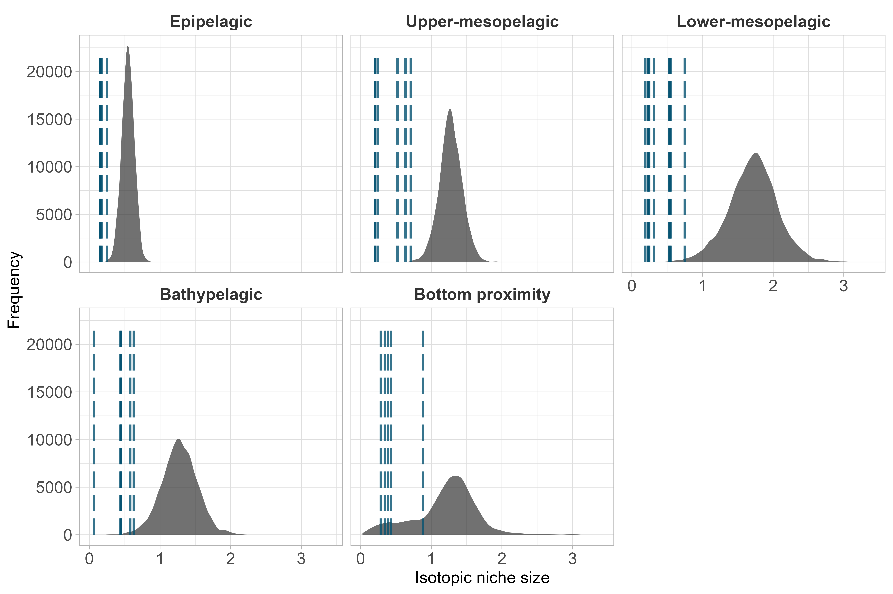

__conclusion :__ modèle déterministe (niches observées plus petites que si distribution des espèces au hasard) pour la plupart des couches de profondeur, sauf couche épipélagique (et station près du fond). Ressources non limitantes dans la couche épipélagique (et près du fond) donc les espèces ne sont pas forcées de se ségréger ? 

## Chevauchements 

- Calcul de la matrix de chevauchement entre les espèces (ellipses à 40%), puis somme de tous les chauvauchements. 

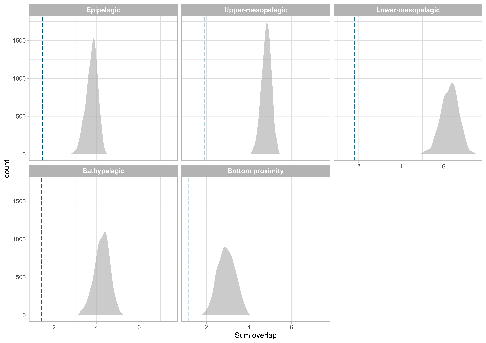
__conclusion:__ 
- les chevauchements observés sont significativement différents que si modèle de distribution au hasard, modèle déterministe. (mais toutes les espèces présentes dans un assemblage non échantillonées, pb?)
- Lower-mesopelagic: nombre d'espèces échantillonnées le plus important (n=9) et valeur observée la plus petite par rapport à la distribution des valeurs permutées: pour le nombre d'espèces présentes peu d'overlap? (et inversement pour bottom proximity?)

## Indices de diversité isotpiques 

- sans prise en compte de la biomasse 


__conclusion:__ modèle stochastique. Sans pondération de la biomasse toutes les espèces ont le même poids dans l'analyse. 

__A garder dans le papier?  :__

- Taille des ellipses 
- chevauchements 
- range range carbone et azote

Comme modèle déterministe, quelles sont les forces évolutives/les axes de ségragtion qui rentrent en jeu pour expliquer cette structure? 

- Calcul des indices de disversité isotopiques pondéré par la biomasse ? La structure de la communauté peut être aussi expliquée par la répartition de la biomassse des espèces au sein de l'espace isotopique ? 
- Autre axe de ségrégation le long du gradient de niveau trophique 
- Le long du gradient de profondeur (analyse cluster guildes trophiques avec mise en lien de la distribution en profondeur des espèces)


::: {.cell}

```{.r .cell-code  code-fold="true"}
isotope_data_sum <- isotope_data%>%
  group_by(species)%>%
  mutate(mean_d13c=mean(d13c),
         sd_d13c=sd(d13c),
         mean_d15n=mean(d15n),
         sd_d15n=sd(d15n),
         n=n())%>%
  select(species, mean_d13c, sd_d13c, mean_d15n, sd_d15n, n, number_ind_pool, family)%>%
  distinct()%>%
  mutate(across(where(is.numeric), round, 2))

htmltools::tagList(DT::datatable(isotope_data_sum))
```

::: {.cell-output-display}

```{=html}
<div class="datatables html-widget html-fill-item-overflow-hidden html-fill-item" id="htmlwidget-6db61f60061a44b44bc4" style="width:100%;height:auto;"></div>
<script type="application/json" data-for="htmlwidget-6db61f60061a44b44bc4">{"x":{"filter":"none","vertical":false,"data":[["1","2","3","4","5","6","7","8","9","10","11","12","13","14","15","16","17"],["Arctozenus_risso","Argyropelecus_olfersii","Benthosema_glaciale","Cyclothone","Lampanyctus_crocodilus","Lampanyctus_macdonaldi","Lestidiops_sphyrenoides","Maulisia_argipalla","Maurolicus_muelleri","Meganyctiphanes_norvegica","Melanostigma_atlanticum","Myctophum_punctatum","Notoscopelus_bolini","Notoscopelus_kroyeri","Searsia_koefoedi","Serrivomer_beanii","Xenodermichthys_copei"],[-20.01,-19.77,-19.46,-19.6,-19.65,-19.67,-20.04,-19.46,-20.53,-20.57,-19.69,-19.99,-19.83,-19.73,-19.61,-19.99,-20.32],[0.23,0.22,0.3,0.18,0.43,0.43,0.26,0.19,0.11,0.23,0.19,0.39,0.18,0.27,0.45,0.26,0.24],[10.52,10.18,9.91,10.98,10.42,11.52,10.72,12.01,9.869999999999999,8.5,11.28,9.92,11.13,11.17,11.85,9.470000000000001,9.800000000000001],[0.35,0.43,0.64,0.54,0.67,0.32,0.35,0.38,0.52,0.33,0.46,0.42,0.31,0.25,0.64,0.55,0.67],[43,41,20,20,120,20,12,14,20,35,20,57,20,60,14,26,97],[1,1,3,2,1,1,1,1,4,5,1,1,1,1,1,1,1],["Paralepididae","Sternoptychidae","Myctophidae","Gonostomatidae","Myctophidae","Myctophidae","Lestidiidae","Platytroctidae","Sternoptychidae","Euphausiidae","Zoarcidae","Myctophidae","Myctophidae","Myctophidae","Platytroctidae","Serrivomeridae","Alepocephalidae"]],"container":"<table class=\"display\">\n  <thead>\n    <tr>\n      <th> <\/th>\n      <th>species<\/th>\n      <th>mean_d13c<\/th>\n      <th>sd_d13c<\/th>\n      <th>mean_d15n<\/th>\n      <th>sd_d15n<\/th>\n      <th>n<\/th>\n      <th>number_ind_pool<\/th>\n      <th>family<\/th>\n    <\/tr>\n  <\/thead>\n<\/table>","options":{"columnDefs":[{"className":"dt-right","targets":[2,3,4,5,6,7]},{"orderable":false,"targets":0}],"order":[],"autoWidth":false,"orderClasses":false}},"evals":[],"jsHooks":[]}</script>
```

:::
:::


# 3. Isotopic niches

## Ellipses

-   ellipses at 40%
-   Δ $\delta$<sup>13</sup>C = 2.36‰
-   Δ $\delta$<sup>15</sup>N = 5.94‰


::: {.cell}

```{.r .cell-code  code-fold="true"}
niche_plot_community <- isotope_data%>%
  mutate(species= gsub("_"," ", species))%>%
    mutate(species=recode(species, "Cyclothone"="Cyclothone spp."))

# colors selection 
nichecol_krill <- c("#E4A33A", "#F67451", "#D664BE", "#3DA5D9", "#94b3ae",
                    "#18206F", "#FD151B", "#049A8F", "#072AC8", "black", "purple", 
                    "#d193f7", "#d8c2ab", "#678FCB", "#A63A49", "#00547A", "#6B54A0")

# size of the ellipse 
p.ell<-0.40
 
# plot
ggplot(data = niche_plot_community, 
                         aes(x = d13c, 
                             y = d15n)) + 
  geom_point(aes(color = species, shape= taxon), size = 2) +
  scale_color_manual(values=nichecol_krill)+  
  scale_fill_manual(values=nichecol_krill)+
  scale_shape_manual(values= c(19, 3))+
  scale_x_continuous(expression({delta}^13*C~'\u2030'), limits = c(-21, -18.5)) +
  scale_y_continuous(expression({delta}^15*N~'\u2030'), limits = c(7, 14))+
  stat_ellipse(aes(group = species, fill = species, color = species), 
               alpha = 0.2, level = p.ell,linewidth = 0.7, type = "norm", geom = "polygon")+
  theme_light()+
  theme(legend.text = element_text(size=15),
        legend.title = element_text(size=15),
        axis.title = element_text(size=15),
        axis.text = element_text(size=15))+
  labs(shape="Taxon", col= "Species", fill="Species")
```

::: {.cell-output-display}
{width=960}
:::

```{.r .cell-code  code-fold="true"}
#ggsave("niches_community.png", path = "figures", dpi = 700, height = 10, width = 12)
```
:::


## Niche areas


::: {.cell layout-align="center"}

```{.r .cell-code  code-fold="true"}
# Model initialization ----
# options for running jags
parms <- list()
parms$n.iter <- 2 * 10^4   # number of iterations to run the model for
parms$n.burnin <- 1 * 10^3 # discard the first set of values
parms$n.thin <- 10     # thin the posterior by this many
parms$n.chains <- 2        # run this many chains
parms$save.output = FALSE
parms$save.dir = tempdir()

# define the priors
priors <- list()
priors$R <- 1 * diag(2)
priors$k <- 2
priors$tau.mu <- 1.0E-3

# Niche area ----
community_siber <- isotope_data%>%
  select(-group)%>%
  mutate(group = species, 
         # All species in the same community (no segregation by depth)
         community = "",
         iso1=d13c,
         iso2 =d15n,
         .keep = "unused")%>%
  select(group, community, iso1, iso2)%>%
  relocate(iso1, .before = group)%>%
  relocate(iso2, .after = iso1)%>%
  # Reorder species by SEA
  mutate(group_order = forcats::fct_relevel(group, c("Searsia_koefoedi", "Lampanyctus_crocodilus",
                                              "Myctophum_punctatum", "Benthosema_glaciale",
                                              "Xenodermichthys_copei", "Lampanyctus_macdonaldi",
                                              "Serrivomer_beanii", "Cyclothone spp.", "Argyropelecus_olfersii",
                                              "Melanostigma_atlanticum", "Arctozenus_risso", "Maulisia_argipalla",
                                              "Notoscopelus_kroyeri", "Lestidiops_sphyrenoides",
                                              "Notoscopelus_bolini", "Maurolicus_muelleri", "Meganyctiphanes_norvegica"))) %>%
  arrange(group_order)%>%
  select(-group)%>%
  rename("group"="group_order")%>%
  relocate(community, .after = group)

# create the siber object
community_siber_obj <- SIBER::createSiberObject(community_siber)

# Calculate summary statistics for each group: TA, SEA and SEAc
group_ML <- SIBER::groupMetricsML(community_siber_obj)

# fit the ellipses which uses an Inverse Wishart prior
# on the covariance matrix Sigma, and a vague normal prior on the 
# means. Fitting is via the JAGS method.
ellipses_posterior_community <- SIBER::siberMVN(community_siber_obj, parms, priors)
```

::: {.cell-output .cell-output-stdout}
```
Compiling model graph
   Resolving undeclared variables
   Allocating nodes
Graph information:
   Observed stochastic nodes: 14
   Unobserved stochastic nodes: 3
   Total graph size: 29

Initializing model

Compiling model graph
   Resolving undeclared variables
   Allocating nodes
Graph information:
   Observed stochastic nodes: 120
   Unobserved stochastic nodes: 3
   Total graph size: 135

Initializing model

Compiling model graph
   Resolving undeclared variables
   Allocating nodes
Graph information:
   Observed stochastic nodes: 57
   Unobserved stochastic nodes: 3
   Total graph size: 72

Initializing model

Compiling model graph
   Resolving undeclared variables
   Allocating nodes
Graph information:
   Observed stochastic nodes: 20
   Unobserved stochastic nodes: 3
   Total graph size: 35

Initializing model

Compiling model graph
   Resolving undeclared variables
   Allocating nodes
Graph information:
   Observed stochastic nodes: 97
   Unobserved stochastic nodes: 3
   Total graph size: 112

Initializing model

Compiling model graph
   Resolving undeclared variables
   Allocating nodes
Graph information:
   Observed stochastic nodes: 20
   Unobserved stochastic nodes: 3
   Total graph size: 35

Initializing model

Compiling model graph
   Resolving undeclared variables
   Allocating nodes
Graph information:
   Observed stochastic nodes: 26
   Unobserved stochastic nodes: 3
   Total graph size: 41

Initializing model

Compiling model graph
   Resolving undeclared variables
   Allocating nodes
Graph information:
   Observed stochastic nodes: 41
   Unobserved stochastic nodes: 3
   Total graph size: 56

Initializing model

Compiling model graph
   Resolving undeclared variables
   Allocating nodes
Graph information:
   Observed stochastic nodes: 20
   Unobserved stochastic nodes: 3
   Total graph size: 35

Initializing model

Compiling model graph
   Resolving undeclared variables
   Allocating nodes
Graph information:
   Observed stochastic nodes: 43
   Unobserved stochastic nodes: 3
   Total graph size: 58

Initializing model

Compiling model graph
   Resolving undeclared variables
   Allocating nodes
Graph information:
   Observed stochastic nodes: 14
   Unobserved stochastic nodes: 3
   Total graph size: 29

Initializing model

Compiling model graph
   Resolving undeclared variables
   Allocating nodes
Graph information:
   Observed stochastic nodes: 60
   Unobserved stochastic nodes: 3
   Total graph size: 75

Initializing model

Compiling model graph
   Resolving undeclared variables
   Allocating nodes
Graph information:
   Observed stochastic nodes: 12
   Unobserved stochastic nodes: 3
   Total graph size: 27

Initializing model

Compiling model graph
   Resolving undeclared variables
   Allocating nodes
Graph information:
   Observed stochastic nodes: 20
   Unobserved stochastic nodes: 3
   Total graph size: 35

Initializing model

Compiling model graph
   Resolving undeclared variables
   Allocating nodes
Graph information:
   Observed stochastic nodes: 20
   Unobserved stochastic nodes: 3
   Total graph size: 35

Initializing model

Compiling model graph
   Resolving undeclared variables
   Allocating nodes
Graph information:
   Observed stochastic nodes: 35
   Unobserved stochastic nodes: 3
   Total graph size: 50

Initializing model

Compiling model graph
   Resolving undeclared variables
   Allocating nodes
Graph information:
   Observed stochastic nodes: 20
   Unobserved stochastic nodes: 3
   Total graph size: 35

Initializing model
```
:::

```{.r .cell-code  code-fold="true"}
SEA_B_community <- SIBER::siberEllipses(ellipses_posterior_community)

# colors 
clrs_com <- matrix(c( "#e4c3c8", "#c98891", "#A63A49",
                      "#dee8e6", "#bed1ce", "#94b3ae", 
                      "#F5E9FD", "#E7C9FB", "#d193f7",
                      "#f2d0eb", "#e6a2d8", "#D664BE",
                      "#d2cbe2", "#a698c6", "#6B54A0",
                      "#b9bcd3", "#5d629a", "#18206F",
                      "#b2cbd7", "#6698af", "#00547A",
                      "#c4e4f3", "#8ac9e8", "#3DA5D9",
                      "#fcd5ca", "#f9ab96", "#F67451",
                      "#ECD7F9", "#D09CF1", "purple",
                      "#F9ECD7", "#F1D09C", "#E4A33A",
                      "#cceae8", "#68c2bb", "#049A8F",
                      "#c2d2ea", "#a3bbdf", "#678FCB",
                      "#fed0d1", "#fe8a8d", "#FD151B",
                      "#f3ece5", "#e7dacc", "#d8c2ab",
                      "#CDD4F4", "#8394E3", "#072AC8"), nrow = 3, ncol = 16)

# save plot in high quality 
#tiff("SEA.tiff", units="in", width=10, height=7, res=700)

# plot
SIBER::siberDensityPlot(SEA_B_community, xticklabels = colnames(group_ML),
                        ylab = expression("Standard Ellipse Area" ('\u2030' ^2) ),
                        bty = "L",
                        las = 1,
                        xlab = "",
                        #clr = clrs_com,
                        ylims = c(0,1.5))

# Add x's for the ML estimated SEA-c
points(1:ncol(SEA_B_community), group_ML[3,], col="red", pch = "x", lwd = 2)
```

::: {.cell-output-display}
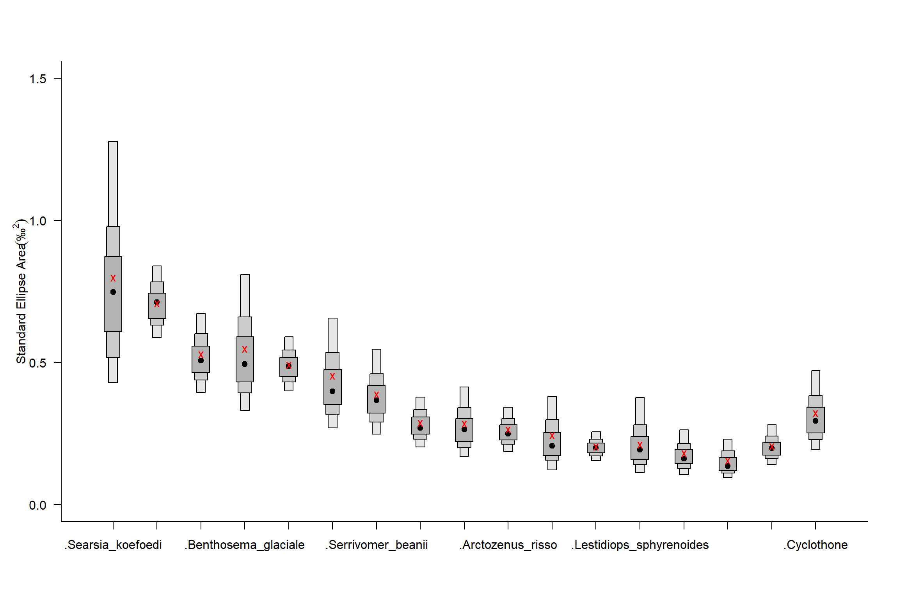{fig-align='center' width=1152}
:::

```{.r .cell-code  code-fold="true"}
#dev.off()

cr.p <- c(0.95, 0.99) # vector of quantiles

# do similar to get the modes, taking care to pick up multimodal posterior
# distributions if present
SEA_B_community_modes <- lapply(
  as.data.frame(SEA_B_community), 
  function(x,...){tmp<-hdrcde::hdr(x)$mode},
  prob = cr.p, all.modes=T)
```
:::


## Overlaps


::: {.cell}

```{.r .cell-code  code-fold="true"}
# Prepare data 
mat_overlap_data <- isotope_data%>%
  filter(taxon=="Fish")%>%
  mutate(species= gsub("_"," ", species))%>%
  mutate(species=recode(species, "Cyclothone"="Cyclothone spp."))

# Arrange species by their d15n values 
mat_overlap <- mat_overlap_data%>%
  group_by(species)%>%
  mutate(mean_d15n=mean(d15n))%>%
  arrange(mean_d15n)%>%
  as.data.frame()

# ellipse at 40%
test.elp_community <- rKIN::estEllipse(data= mat_overlap,  x="d13c", y="d15n", group="species", levels=40, smallSamp = TRUE)
```

::: {.cell-output .cell-output-stdout}
```
[1] "data.frame"
[1] "data.frame"
[1] "data.frame"
[1] "data.frame"
[1] "data.frame"
[1] "data.frame"
[1] "data.frame"
[1] "data.frame"
[1] "data.frame"
[1] "data.frame"
[1] "data.frame"
[1] "data.frame"
[1] "data.frame"
[1] "data.frame"
[1] "data.frame"
[1] "data.frame"
```
:::

```{.r .cell-code  code-fold="true"}
# Extract the area of each polygon
elp.area_community <- rKIN::getArea(test.elp_community)

# determine polygon overlap for all polygons
elp.olp_community <- rKIN::calcOverlap(test.elp_community)%>%
  #renames rownames
  mutate(OverlapID= gsub("_"," ", OverlapID))%>%
  mutate(OverlapID= gsub("40","", OverlapID))%>%
  mutate(across(where(is.numeric), round, 2))%>%
  tibble::column_to_rownames("OverlapID")%>%
  as.data.frame()

#renames colnames
colnames(elp.olp_community)<- gsub(x =colnames(elp.olp_community), pattern = "_", replacement = " ")
colnames(elp.olp_community)<- gsub(x =colnames(elp.olp_community), pattern = "40", replacement = "")

#plot 
ggcorrplot::ggcorrplot(elp.olp_community, lab = T, outline.color = "white", lab_size = 3, tl.cex = 10)+
  scale_fill_gradient2(limit = c(0,1), low = "white", high = "grey50", mid = "grey80", midpoint = 0.5)+
  labs(fill="Overlap value")+
  theme(axis.text = element_text(face="italic", size = 10),
        legend.text = element_text(size=10),
        legend.title = element_text(size=10),
        plot.background = element_rect(colour = "white"))
```

::: {.cell-output-display}
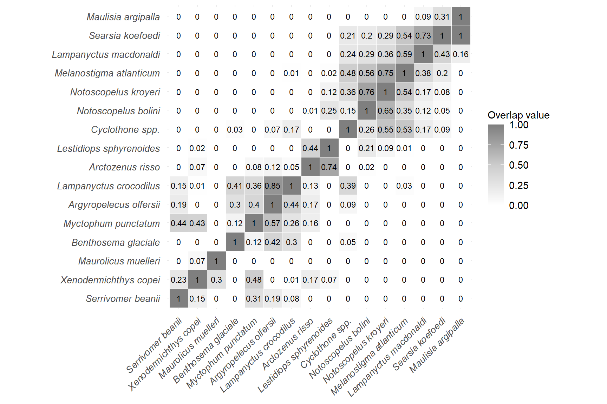{width=864}
:::

```{.r .cell-code  code-fold="true"}
#ggsave("matrix_overlap.png", path = "figures", dpi = 700, width = 8, height = 6)
```
:::


# 4. Depth segregation

## Cluster

-   input data for cluster = overlap matrix
-   depth distribution = from complete 2021 trawling data (not only individuals sampled for isotope)


::: {.cell layout-align="center"}

```{.r .cell-code  code-fold="true"}
# calculate median depth by species with trawling data set 2021
mean_depth_sp <- density_distribution%>%
  group_by(Nom_Scientifique)%>%
  mutate(median_depth=median(trawling_depth))%>%
  select(Nom_Scientifique, median_depth)%>%
  distinct()%>%
  ungroup()%>%
  arrange(Nom_Scientifique)%>%
  rename(species=Nom_Scientifique)

# calcul overlap ellipse 40%
# test.elp_community <- rKIN::estEllipse(data= isotope_data_fish,  x="d13c", y="d15n", group="species", levels=40, smallSamp = TRUE)
# elp.olp_community <- rKIN::calcOverlap(test.elp_community)
# 
# df <- elp.olp_community%>%
#   tibble::column_to_rownames(var="OverlapID")%>%
#   as.data.frame()

# Gap statistic
factoextra::fviz_nbclust(elp.olp_community , kmeans, nstart = 25,  method = "gap_stat", nboot = 100, verbose = FALSE)+
  labs(subtitle = "Gap statistic method")
```

::: {.cell-output-display}
{fig-align='center' width=672}
:::

```{.r .cell-code  code-fold="true"}
res.km <- kmeans(scale(elp.olp_community ),5, nstart = 25)

# Réduction de dimension en utilisant l'ACP
res.pca <- prcomp(elp.olp_community [, -5],  scale = TRUE)
# Coordonnées des individus
ind.coord <- as.data.frame(factoextra::get_pca_ind(res.pca)$coord)
# Ajouter les clusters obtenus à l'aide de l'algorithme k-means
ind.coord$cluster <- factor(res.km$cluster)
# Percentage of variance explained by dimensions
eigenvalue <- round(factoextra::get_eigenvalue(res.pca), 1)
variance.percent <- eigenvalue$variance.percent

# Add species names and median depth 
ind.coord_depth <- cbind(ind.coord, mean_depth_sp)
ind.coord_depth$median_depth <- as.factor(ind.coord_depth$median_depth)
```
:::


## Cluster and depth distribution


::: {.cell}

```{.r .cell-code  code-fold="true"}
# dendrogram ----
dend <- elp.olp_community %>%
  dist() %>%
  hclust() %>%
  as.dendrogram()

#png("figures/dendrogram.png", units="in", width=6, height=4, res=700)
par(mar = c(1, 1, 1, 10))
dend %>%
  dendextend::set("labels_col",
      value = c("#86BBBD", "#ECA72C", "#4D85A8", "#9BABE8", "#D35D4A"),
      k = 5) %>%
  dendextend::set("branches_k_color",
      value = c("#86BBBD", "#ECA72C", "#4D85A8", "#9BABE8", "#D35D4A"),
      k = 5) %>%
  dendextend::set("labels_cex", 0.6) %>%
  dendextend::set("branches_lty", 2) %>%
  dendextend::set("leaves_bg") %>%
  dendextend::set("leaves_pch", 19) %>%
  dendextend::set("leaves_col",
    c(
      "#86BBBD",
      "#86BBBD",
      "#86BBBD",
      "#86BBBD",
      "#86BBBD",
      "#ECA72C",
      "#ECA72C",
      "#ECA72C",
      "#ECA72C",
      "#4D85A8",
      "#4D85A8",
      "#4D85A8",
      "#9BABE8",
      "#9BABE8",
      "#D35D4A",
      "#D35D4A"
    )
  ) %>%
  plot(horiz = TRUE, axes = FALSE)
```

::: {.cell-output-display}
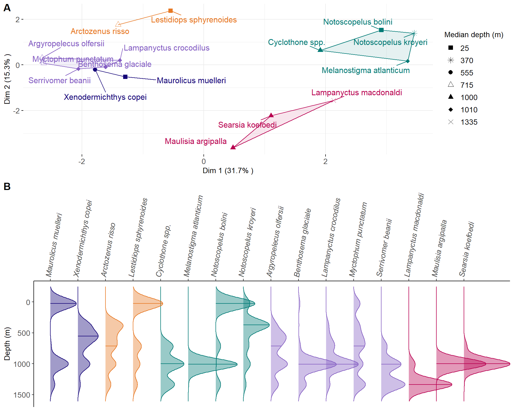{width=960}
:::

```{.r .cell-code  code-fold="true"}
#dev.off()

# Density plot----
# assign each species to a cluster 
density_distribution_cluster <- density_distribution%>%
  mutate(cluster=case_when(Nom_Scientifique%in% c("Argyropelecus olfersii", "Lampanyctus crocodilus",
                                                  "Benthosema glaciale","Myctophum punctatum","Serrivomer beanii")~4,
                           Nom_Scientifique%in% c("Lampanyctus macdonaldi", "Maulisia argipalla",
                                                  "Searsia koefoedi")~5,
                           Nom_Scientifique%in% c("Cyclothone spp.","Notoscopelus bolini", "Notoscopelus kroyeri",
                                                  "Melanostigma atlanticum")~3,
                           Nom_Scientifique%in% c("Xenodermichthys copei", "Maurolicus muelleri")~1,
                           Nom_Scientifique%in% c("Arctozenus risso","Lestidiops sphyrenoides")~2))%>%
  group_by(Nom_Scientifique)%>%
  arrange(desc(trawling_depth))

# Order in function of median depth
density_distribution_cluster$Nom_Scientifique = with(density_distribution_cluster, reorder(Nom_Scientifique, cluster, max))  

ggplot(density_distribution_cluster,
       aes(x = trawling_depth, y = Nom_Scientifique, group = Nom_Scientifique, 
           col=factor(cluster), fill=factor(cluster)))+ 
  scale_fill_manual(values = c("#D35D4A", "#9BABE8", "#ECA72C", "#86BBBD","#4D85A8"))+
  scale_color_manual(values = c("#D35D4A", "#9BABE8", "#ECA72C", "#86BBBD","#4D85A8"))+
  ggridges::stat_density_ridges(quantile_lines = TRUE, quantiles = 0.5 , alpha=0.4, size=0.7,
                                rel_min_height = 0.002, scale=1.2)+
  theme_light()+
  scale_y_discrete(position = "left")+
  scale_x_reverse(limits = c( 1400,0))+
  coord_flip()+
  ylab(label = "")+ xlab("Depth (m)")+
  theme(axis.text.y = element_text(size=10.5),
        axis.text.x = element_text(face="italic", size=10.5, angle=80, vjust = 0.5, hjust=0.5),
        axis.title.x = element_text(size=10.5),
        axis.title.y = element_text(size=10.5))+
  guides(fill="none", col="none", alpha="none")
```

::: {.cell-output-display}
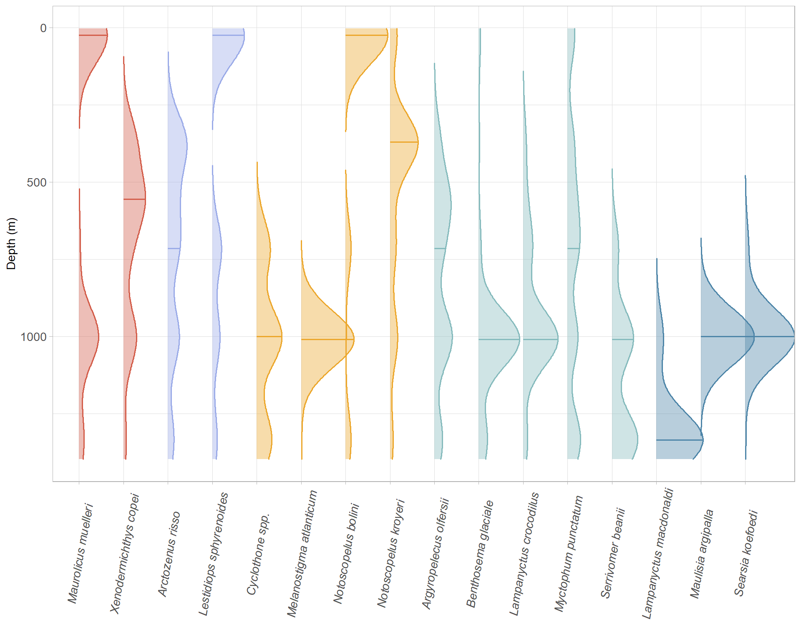{width=960}
:::

```{.r .cell-code  code-fold="true"}
ggsave("density_plot.png", path = "figures", dpi = 600, height = 8, width = 10)
```
:::


# 5. Isotopic diversity index

## Definitions

-   **Isotopic divergence** : tends to 1 when all points (or their weights) are located at the edge of the convex hull, i.e. when the oragnisms with the most extreme isotopic values dominate the food web

-   **Isotopic dispersion**: equal to 1 when most points (or their weights) are far from the center of gravity of the point group, i.e. when organisms tend to have contrasting isotopic values

-   **Isotopic evenness**: tends to 1 when all organisms are equally distributed in isotopic space

-   **Isotopic uniqueness**: tends to 1 when most organisms (or their weights) are isolated in isotopic space, i.e. when most organisms (or those with the highest abundance) are isolated in isotopic space, their isotopic values are very different from the rest of the organisms

## Representativeness of sampling

-   Percentage of species biomass in each station


::: {.cell}

```{.r .cell-code  code-fold="true"}
# Species % biomass and abundance by station 
species_abundance <- trawling_data_evhoe21%>%
  # selection of mesopelagic trawl 
  filter(Code_Station%in% c("Z0524", "Z0518", "Z0512", "Z0508", 
                            "Z0503", "Z0497", "Z0492"))%>%
  #deletion when only genus name and genus already sampled in isotopy + A. carbo
  filter(!Nom_Scientifique%in%c("Cyclothone braueri","Cyclothone microdon", 
                                "Myctophidae", "Aphanopus carbo"))%>%
    mutate(
    depth_layer = case_when(
      Code_Station %in% c("Z0508") ~ "epipelagic",
      Code_Station %in% c("Z0492", "Z0512") ~ "upper-mesopelagic",
      Code_Station %in% c("Z0503", "Z0518") ~ "lower-mesopelagic",
      Code_Station %in% c("Z0497") ~ "bathypelagic",
      Code_Station %in% c("Z0524") ~ "bottom-proximity")) %>%
  select(depth_layer, Nbr, Nom_Scientifique, Tot_V_HV)%>%
  group_by(Nom_Scientifique, depth_layer)%>%
  mutate(nb_ind= sum(Nbr))%>%
  select(-Nbr)%>%
  distinct()%>%
  group_by(depth_layer)%>%
  mutate(sum_biomass_station=sum(Tot_V_HV))%>%
  ungroup()%>%
  group_by(depth_layer, Nom_Scientifique)%>%
  mutate(pourcentage_biomass_sp= Tot_V_HV/sum_biomass_station*100)%>%
  select(Nom_Scientifique, pourcentage_biomass_sp, nb_ind, depth_layer)%>%
  mutate(across(where(is.numeric), round, 2))
  
htmltools::tagList(DT::datatable(species_abundance))
```

::: {.cell-output-display}

```{=html}
<div class="datatables html-widget html-fill-item-overflow-hidden html-fill-item" id="htmlwidget-26e73bd7a8b6f4359b0d" style="width:100%;height:auto;"></div>
<script type="application/json" data-for="htmlwidget-26e73bd7a8b6f4359b0d">{"x":{"filter":"none","vertical":false,"data":[["1","2","3","4","5","6","7","8","9","10","11","12","13","14","15","16","17","18","19","20","21","22","23","24","25","26","27","28","29","30","31","32","33","34","35","36","37","38","39","40","41","42","43","44","45","46","47","48","49","50","51","52","53","54","55","56","57","58","59","60","61","62","63","64","65","66","67","68","69","70","71","72","73","74","75","76","77","78","79","80","81","82","83","84","85","86","87","88","89","90","91","92","93","94","95","96","97","98","99","100","101","102","103","104","105","106","107","108","109","110","111","112","113","114","115","116","117","118","119","120","121","122","123","124","125","126","127","128","129","130","131","132","133","134","135","136","137","138","139","140","141","142","143","144","145","146","147","148"],["Xenodermichthys copei","Argyropelecus olfersii","Maurolicus muelleri","Stomias boa boa","Myctophum punctatum","Benthosema glaciale","Ceratoscopelus maderensis","Lampanyctus crocodilus","Notoscopelus kroyeri","Arctozenus risso","Melanostomias bartonbeani","Xenodermichthys copei","Cyclothone","Argyropelecus olfersii","Maurolicus muelleri","Borostomias antarcticus","Chauliodus sloani","Stomias boa boa","Nansenia oblita","Myctophum punctatum","Benthosema glaciale","Ceratoscopelus maderensis","Lampanyctus crocodilus","Nannobrachium atrum","Lampanyctus macdonaldi","Lobianchia gemellarii","Notoscopelus bolini","Notoscopelus kroyeri","Paralepis coregonoides","Lestidiops sphyrenoides","Arctozenus risso","Derichthys serpentinus","Synaphobranchus kaupii","Melanostigma atlanticum","Bathylagus euryops","Sigmops bathyphilus","Malacosteus niger","Melanostomias bartonbeani","Serrivomer beanii","Bolinichthys supralateralis","Photostylus pycnopterus","Eurypharynx pelecanoides","Searsia koefoedi","Mentodus rostratus","Xenodermichthys copei","Cyclothone","Argyropelecus hemigymnus","Argyropelecus olfersii","Maurolicus muelleri","Chauliodus sloani","Stomias boa boa","Myctophum punctatum","Benthosema glaciale","Ceratoscopelus maderensis","Lampanyctus crocodilus","Notoscopelus bolini","Notoscopelus kroyeri","Lestidiops sphyrenoides","Arctozenus risso","Melanostigma atlanticum","Melanostomias bartonbeani","Serrivomer beanii","Sudis hyalina","Sagamichthys schnakenbecki","Searsia koefoedi","Pseudoscopelus altipinnis","Maurolicus muelleri","Chauliodus sloani","Myctophum punctatum","Benthosema glaciale","Ceratoscopelus maderensis","Lampanyctus","Notoscopelus bolini","Notoscopelus kroyeri","Notoscopelus kroyeri","Lestidiops sphyrenoides","Melanostomias bartonbeani","Dolicholagus longirostris","Xenodermichthys copei","Cyclothone","Argyropelecus olfersii","Myctophum punctatum","Benthosema glaciale","Ceratoscopelus maderensis","Lampanyctus","Lampanyctus crocodilus","Nannobrachium atrum","Notoscopelus kroyeri","Evermannella balbo","Arctozenus risso","Melanostigma atlanticum","Nansenia","Dolicholagus longirostris","Xenodermichthys copei","Cyclothone","Argyropelecus olfersii","Maurolicus muelleri","Stomias boa boa","Myctophum punctatum","Benthosema glaciale","Ceratoscopelus maderensis","Diaphus holti","Lampanyctus crocodilus","Nannobrachium atrum","Lampanyctus macdonaldi","Notoscopelus bolini","Notoscopelus kroyeri","Evermannella balbo","Lestidiops sphyrenoides","Arctozenus risso","Melanostigma atlanticum","Malacosteus niger","Maulisia argipalla","Normichthys operosus","Serrivomer beanii","Parabrotulidae","Photostylus pycnopterus","Sagamichthys schnakenbecki","Searsia koefoedi","Alepocephalus bairdii","Xenodermichthys copei","Cyclothone","Argyropelecus olfersii","Chauliodus sloani","Stomias boa boa","Myctophum punctatum","Benthosema glaciale","Lampanyctus crocodilus","Nannobrachium atrum","Lampanyctus macdonaldi","Notoscopelus kroyeri","Evermannella balbo","Lestidiops sphyrenoides","Arctozenus risso","Melanostigma atlanticum","Malacosteus niger","Maulisia argipalla","Normichthys operosus","Serrivomer beanii","Nannobrachium lineatum","Taaningichthys paurolychnus","Aphyonidae","Parabrotulidae","Photostylus pycnopterus","Gonostoma elongatum","Sagamichthys schnakenbecki","Searsia koefoedi","Neonesthes capensis"],[13.14,0.5600000000000001,0.07000000000000001,4.98,1.48,0.13,0.09,5.41,31.73,3.61,2.5,4.86,5.62,1.27,2.69,4.02,2.26,3.47,0.12,4.92,2.95,0.41,13.86,1.48,18.78,0.29,1.62,5.73,0.2,0.23,1.91,0.41,0.03,0.06,3.07,0.32,0.43,1.33,15.77,0.84,0.32,0.29,0.17,0.26,6.36,2.55,0.01,0.66,0.37,0.6,3.37,1.98,0.36,0.34,14.62,0.77,5.39,0.24,1.68,0.01,0.43,2.04,0.92,1.24,0.39,0.39,38.54,0.21,6.59,1.33,0.07000000000000001,0.42,30.06,8.199999999999999,7.43,3.92,0.98,2.24,20.61,0.02,1.42,1.77,0.04,0.22,0.02,6.43,0.36,3.01,0.11,1.62,0.02,0.15,0.51,6.7,3.34,1,5.72,0.77,1.46,0.95,0.04,0.04,15.14,1.71,0.4,0.09,4.17,0.28,0.1,1.24,0.25,1.56,2.12,0.64,3.07,0.01,0.01,0.03,4.4,0.2,5.99,1.9,0.63,2.63,0.96,0.61,8.09,56.18,0.77,1.16,3.41,0.33,0.11,0.8100000000000001,3.48,2.62,0.41,0.07000000000000001,4.72,0.5,0.18,0.02,0.02,0.02,1.47,0.02,1.51,1.2],[211,24,7,5,43,14,4,132,200,41,4,21,582,11,532,3,2,5,1,43,102,3,50,5,31,1,10,24,2,2,8,2,2,2,9,3,1,2,12,1,3,1,1,5,109,1091,1,13,2547,1,5,62,157,7,209,10,232,8,23,14,1,10,1,11,17,1,3360,1,26,58,1,76,73,198,198,16,1,3,211,2,24,43,14,4,2,132,2,200,1,41,2,2,1,109,1091,13,2547,5,62,157,7,1,209,9,1,10,232,2,8,23,14,1,16,4,10,1,1,11,17,1,36,262,4,3,1,11,617,84,4,3,28,2,2,6,81,3,3,1,4,1,3,1,3,1,1,1,5,1],["upper-mesopelagic","upper-mesopelagic","upper-mesopelagic","upper-mesopelagic","upper-mesopelagic","upper-mesopelagic","upper-mesopelagic","upper-mesopelagic","upper-mesopelagic","upper-mesopelagic","upper-mesopelagic","bathypelagic","bathypelagic","bathypelagic","bathypelagic","bathypelagic","bathypelagic","bathypelagic","bathypelagic","bathypelagic","bathypelagic","bathypelagic","bathypelagic","bathypelagic","bathypelagic","bathypelagic","bathypelagic","bathypelagic","bathypelagic","bathypelagic","bathypelagic","bathypelagic","bathypelagic","bathypelagic","bathypelagic","bathypelagic","bathypelagic","bathypelagic","bathypelagic","bathypelagic","bathypelagic","bathypelagic","bathypelagic","bathypelagic","lower-mesopelagic","lower-mesopelagic","lower-mesopelagic","lower-mesopelagic","lower-mesopelagic","lower-mesopelagic","lower-mesopelagic","lower-mesopelagic","lower-mesopelagic","lower-mesopelagic","lower-mesopelagic","lower-mesopelagic","lower-mesopelagic","lower-mesopelagic","lower-mesopelagic","lower-mesopelagic","lower-mesopelagic","lower-mesopelagic","lower-mesopelagic","lower-mesopelagic","lower-mesopelagic","lower-mesopelagic","epipelagic","epipelagic","epipelagic","epipelagic","epipelagic","epipelagic","epipelagic","epipelagic","epipelagic","epipelagic","epipelagic","epipelagic","upper-mesopelagic","upper-mesopelagic","upper-mesopelagic","upper-mesopelagic","upper-mesopelagic","upper-mesopelagic","upper-mesopelagic","upper-mesopelagic","upper-mesopelagic","upper-mesopelagic","upper-mesopelagic","upper-mesopelagic","upper-mesopelagic","upper-mesopelagic","upper-mesopelagic","lower-mesopelagic","lower-mesopelagic","lower-mesopelagic","lower-mesopelagic","lower-mesopelagic","lower-mesopelagic","lower-mesopelagic","lower-mesopelagic","lower-mesopelagic","lower-mesopelagic","lower-mesopelagic","lower-mesopelagic","lower-mesopelagic","lower-mesopelagic","lower-mesopelagic","lower-mesopelagic","lower-mesopelagic","lower-mesopelagic","lower-mesopelagic","lower-mesopelagic","lower-mesopelagic","lower-mesopelagic","lower-mesopelagic","lower-mesopelagic","lower-mesopelagic","lower-mesopelagic","bottom-proximity","bottom-proximity","bottom-proximity","bottom-proximity","bottom-proximity","bottom-proximity","bottom-proximity","bottom-proximity","bottom-proximity","bottom-proximity","bottom-proximity","bottom-proximity","bottom-proximity","bottom-proximity","bottom-proximity","bottom-proximity","bottom-proximity","bottom-proximity","bottom-proximity","bottom-proximity","bottom-proximity","bottom-proximity","bottom-proximity","bottom-proximity","bottom-proximity","bottom-proximity","bottom-proximity","bottom-proximity","bottom-proximity"]],"container":"<table class=\"display\">\n  <thead>\n    <tr>\n      <th> <\/th>\n      <th>Nom_Scientifique<\/th>\n      <th>pourcentage_biomass_sp<\/th>\n      <th>nb_ind<\/th>\n      <th>depth_layer<\/th>\n    <\/tr>\n  <\/thead>\n<\/table>","options":{"columnDefs":[{"className":"dt-right","targets":[2,3]},{"orderable":false,"targets":0}],"order":[],"autoWidth":false,"orderClasses":false}},"evals":[],"jsHooks":[]}</script>
```

:::
:::


## Calculation

-   Formatting of data and calculation of relative biomass within each station


::: {.cell}

```{.r .cell-code  code-fold="true"}
# Load data 
isotope_data_fish <- isotope_data %>% filter (species != "Meganyctiphanes_norvegica")

# sourcing the R functions from 'si_div' R script
#source("R/si_div.R")
source("R/si_div.R")

# Format indiviudal_si
individuals_si <- isotope_data_fish %>%
  select(individual_code, station, d13c, d15n, species_code) %>%
  rename(indiv_ID=individual_code,
         d13C= d13c,
         d15N =d15n,
         Species_code= species_code)%>%
  arrange(Species_code)

# species_status_biomass ----
# with all species sampled (not only species sampled for isotope)

# load total trawling data evhoe 2021
trawling_data_evhoe21 <-  utils::read.csv(here::here("data", "trawling_data_evhoe_2021.csv"), sep = ";", header = T, dec = ".")


species_status_biomass <- trawling_data_evhoe21 %>%
  # selection of mesopelagic trawl
  filter(Code_Station %in% c("Z0524", "Z0518", "Z0512", "Z0508",
                             "Z0503", "Z0497", "Z0492")) %>%
  #deletion when only genus name and genus already sampled in isotope + A. carbo
  filter(
    !Nom_Scientifique %in% c(
      "Cyclothone braueri",
      "Cyclothone microdon",
      "Myctophidae",
      "Aphanopus carbo",
      "Lampanyctus"
    )
  ) %>%
  # group by depth layer 
  mutate(
    Status = case_when(
      Code_Station %in% c("Z0508") ~ "epipelagic",
      Code_Station %in% c("Z0492", "Z0512") ~ "upper-mesopelagic",
      Code_Station %in% c("Z0503", "Z0518") ~ "lower-mesopelagic",
      Code_Station %in% c("Z0497") ~ "bathypelagic",
      Code_Station %in% c("Z0524") ~ "bottom-proximity"
    )
  ) %>%
  select(Status,
         Tot_V_HV,
         Nom_Scientifique,
         Code_Espece_Campagne) %>%
  distinct() %>%
  # sum species biomass by depth layer
  group_by(Nom_Scientifique, Status) %>%
  mutate(biomass_sp = sum(Tot_V_HV)) %>%
  select(-Tot_V_HV) %>%
  distinct() %>%
  # sum of total biomass by depth layer
  group_by(Status) %>%
  mutate(biomass_tot = sum(biomass_sp)) %>%
  # relative biomass of each species by station
  mutate(rel_biomass = biomass_sp / biomass_tot * 100) %>%
  select(-c(biomass_sp, biomass_tot)) %>%
  # selection of species sampled for isotopy in each depth
  filter(
    Status == "epipelagic" &
      Nom_Scientifique %in% c(
        "Lestidiops sphyrenoides",
        "Maurolicus muelleri",
        "Myctophum punctatum",
        "Notoscopelus kroyeri",
        "Notoscopelus bolini"
      ) |
      Status == "upper-mesopelagic" &
      Nom_Scientifique %in% c(
        "Arctozenus risso",
        "Argyropelecus olfersii",
        "Lampanyctus crocodilus",
        "Myctophum punctatum",
        "Notoscopelus kroyeri",
        "Xenodermichthys copei"
      ) |
      Status == "lower-mesopelagic" &
      Nom_Scientifique %in% c(
        "Arctozenus risso",
        "Argyropelecus olfersii",
        "Cyclothone",
        "Benthosema glaciale",
        "Lampanyctus crocodilus",
        "Maulisia argipalla",
        "Searsia koefoedi",
        "Serrivomer beanii",
        "Xenodermichthys copei"
      ) |
      Status == "bathypelagic" &
      Nom_Scientifique %in% c(
        "Argyropelecus olfersii",
        "Lampanyctus crocodilus",
        "Lampanyctus macdonaldi",
        "Myctophum punctatum",
        "Serrivomer beanii",
        "Xenodermichthys copei"
      ) |
      Status == "bottom-proximity" &
      Nom_Scientifique %in% c(
        "Argyropelecus olfersii",
        "Lampanyctus crocodilus",
        "Melanostigma atlanticum",
        "Serrivomer beanii",
        "Xenodermichthys copei"
      )
  ) %>%
  mutate(Species_code = tolower(Code_Espece_Campagne)) %>%
  rename(Species_name = Nom_Scientifique) %>%
  select(-Code_Espece_Campagne) %>%
  relocate(Status, .after = rel_biomass) %>%
  relocate(Species_code, .after = Species_name) %>%
  arrange(Species_name) %>%
  distinct()

htmltools::tagList(DT::datatable(species_status_biomass))
```

::: {.cell-output-display}

```{=html}
<div class="datatables html-widget html-fill-item-overflow-hidden html-fill-item" id="htmlwidget-3c756e500e0c6c585a93" style="width:100%;height:auto;"></div>
<script type="application/json" data-for="htmlwidget-3c756e500e0c6c585a93">{"x":{"filter":"none","vertical":false,"data":[["1","2","3","4","5","6","7","8","9","10","11","12","13","14","15","16","17","18","19","20","21","22","23","24","25","26","27","28","29","30","31"],["Arctozenus risso","Arctozenus risso","Argyropelecus olfersii","Argyropelecus olfersii","Argyropelecus olfersii","Argyropelecus olfersii","Benthosema glaciale","Cyclothone","Lampanyctus crocodilus","Lampanyctus crocodilus","Lampanyctus crocodilus","Lampanyctus crocodilus","Lampanyctus macdonaldi","Lestidiops sphyrenoides","Maulisia argipalla","Maurolicus muelleri","Melanostigma atlanticum","Myctophum punctatum","Myctophum punctatum","Myctophum punctatum","Notoscopelus bolini","Notoscopelus kroyeri","Notoscopelus kroyeri","Searsia koefoedi","Serrivomer beanii","Serrivomer beanii","Serrivomer beanii","Xenodermichthys copei","Xenodermichthys copei","Xenodermichthys copei","Xenodermichthys copei"],["noto-ris","noto-ris","argy-olf","argy-olf","argy-olf","argy-olf","bent-gla","cycl-otz","lamp-cro","lamp-cro","lamp-cro","lamp-cro","lamp-mac","lest-sph","maul-arg","maur-mue","mela-atl","myct-pun","myct-pun","myct-pun","noto-bol","noto-kro","noto-kro","sear-koe","serr-bea","serr-bea","serr-bea","xeno-cop","xeno-cop","xeno-cop","xeno-cop"],[5.231498359460446,2.920143027413588,1.986875683558148,1.273516642547033,1.653754469606675,0.626266347393627,1.311084624553039,5.884982121573302,11.84834123222749,13.86396526772793,29.75268176400477,56.17977528089888,18.78437047756874,3.940886699507389,2.115613825983313,38.70513722730472,3.481304107570456,3.244622675902296,4.92040520984081,6.61505981703026,30.19000703729768,34.74298213634707,15.69317382125264,4.782479141835519,15.77424023154848,5.110250297973778,4.715417203904956,33.75865840320817,4.862518089725036,13.06615017878427,5.986369497144963],["upper-mesopelagic","lower-mesopelagic","upper-mesopelagic","bathypelagic","lower-mesopelagic","bottom-proximity","lower-mesopelagic","lower-mesopelagic","upper-mesopelagic","bathypelagic","lower-mesopelagic","bottom-proximity","bathypelagic","epipelagic","lower-mesopelagic","epipelagic","bottom-proximity","upper-mesopelagic","bathypelagic","epipelagic","epipelagic","upper-mesopelagic","epipelagic","lower-mesopelagic","bathypelagic","lower-mesopelagic","bottom-proximity","upper-mesopelagic","bathypelagic","lower-mesopelagic","bottom-proximity"]],"container":"<table class=\"display\">\n  <thead>\n    <tr>\n      <th> <\/th>\n      <th>Species_name<\/th>\n      <th>Species_code<\/th>\n      <th>rel_biomass<\/th>\n      <th>Status<\/th>\n    <\/tr>\n  <\/thead>\n<\/table>","options":{"columnDefs":[{"className":"dt-right","targets":3},{"orderable":false,"targets":0}],"order":[],"autoWidth":false,"orderClasses":false}},"evals":[],"jsHooks":[]}</script>
```

:::
:::

- percentage of biomass sampled for isotopy in each depth layer 

::: {.cell}

```{.r .cell-code  code-fold="true"}
biomass_sampled <- species_status_biomass%>%
  group_by(Status)%>%
  mutate(sum_biomass = sum(rel_biomass))%>%
  select(sum_biomass, Status)%>%
  distinct()

htmltools::tagList(DT::datatable(biomass_sampled))
```

::: {.cell-output-display}

```{=html}
<div class="datatables html-widget html-fill-item-overflow-hidden html-fill-item" id="htmlwidget-27860d0c53ce5b806bc9" style="width:100%;height:auto;"></div>
<script type="application/json" data-for="htmlwidget-27860d0c53ce5b806bc9">{"x":{"filter":"none","vertical":false,"data":[["1","2","3","4","5"],[90.81297849070361,66.59713945172825,59.47901591895803,70.98913243691288,95.14426460239268],["upper-mesopelagic","lower-mesopelagic","bathypelagic","bottom-proximity","epipelagic"]],"container":"<table class=\"display\">\n  <thead>\n    <tr>\n      <th> <\/th>\n      <th>sum_biomass<\/th>\n      <th>Status<\/th>\n    <\/tr>\n  <\/thead>\n<\/table>","options":{"columnDefs":[{"className":"dt-right","targets":1},{"orderable":false,"targets":0}],"order":[],"autoWidth":false,"orderClasses":false}},"evals":[],"jsHooks":[]}</script>
```

:::
:::


### Epipelagic 
_ 25m (Z0508)


::: {.cell}

```{.r .cell-code  code-fold="true"}
# 25m Z0508 ----
individuals_si_epi <- individuals_si%>%
  filter(station =="Z0508")%>%
  select(-station)

status_biomass_epi <- species_status_biomass%>%
  filter(Status=="epipelagic")

# computing mean Stable Isotope values for each species
# "group" column identical to species_code to fit with input format of function meanSI_group
# no "weight" input as number of indivuals sampled per species did not mirror actual species biomass
individuals_si_epi<-data.frame(group=individuals_si_epi[,"Species_code"], individuals_si_epi)
mean_si_species_epi<-meanSI_group(individuals_si_epi)

# computing coefficent of variation within each species to assess intraspecific variability
cbind(CV_d13C=mean_si_species_epi[,"sd_d13C"]/mean_si_species_epi[,"d13C"], CV_d15N=mean_si_species_epi[,"sd_d15N"]/mean_si_species_epi[,"d15N"] )
```

::: {.cell-output .cell-output-stdout}
```
               CV_d13C    CV_d15N
lesti-sph -0.012948117 0.03266115
maur-mue  -0.005224151 0.05249590
myct-pun  -0.009814716 0.04047466
noto-bol  -0.009178283 0.02755544
noto-kro  -0.012155251 0.02163464
```
:::

```{.r .cell-code  code-fold="true"}
# -> intraspecific variability is overall low (<20%)

# checking that species codes are the same in the two tables
#row.names(mean_si_species_epi)==status_biomass_epi[,"Species_code"] # OK

# building a single dataframe with all data for computing isotopic diversity indices
data_fish_epi <-data.frame(mean_si_species_epi[,c("d13C","d15N", "sd_d13C","sd_d15N")], rel_biomass=status_biomass_epi[,"rel_biomass"], Status=status_biomass_epi[,"Status"], latin_name=status_biomass_epi[,"Species_name"])

# scaling mean stable isotopes values using function "scale_rge01"
data_fish_scl_epi<-scaleSI_range01(data_fish_epi)

# computing isotopic diversity of the whole fish assemblage using scaled isotopic values and species relative biomass
ID_scl_ab_epi<-IDiversity(cons=data_fish_scl_epi, weight=data_fish_scl_epi[,c("rel_biomass")], nm_plot="1_epipelagic")

# printing results
result <- as.data.frame(round(ID_scl_ab_epi,3)) 
```
:::


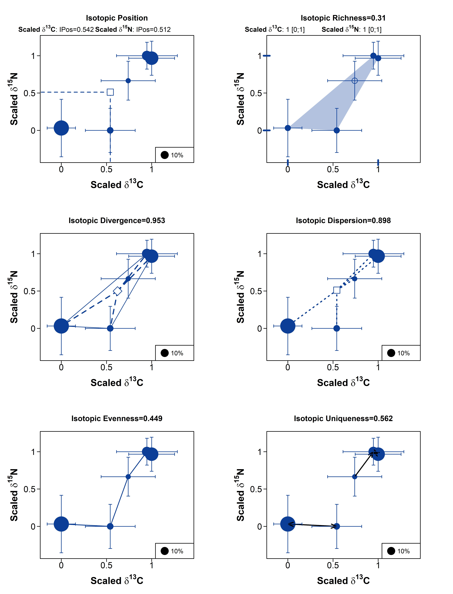{width="550"}

### Upper mesopelagic
-  370m (Z0492) & 555m (Z0512)

::: {.cell}

```{.r .cell-code  code-fold="true"}
individuals_si_upm <- individuals_si%>%
  filter(station%in%c("Z0492", "Z0512"))%>%
  select(-station)

status_biomass_upm <- species_status_biomass%>%
  filter(Status=="upper-mesopelagic")

# computing mean Stable Isotope values for each species
individuals_si_upm<-data.frame(group=individuals_si_upm[,"Species_code"], individuals_si_upm)
mean_si_species_upm<-meanSI_group(individuals_si_upm)

# computing coefficent of variation within each species to assess intraspecific variability
cbind(CV_d13C=mean_si_species_upm[,"sd_d13C"]/mean_si_species_upm[,"d13C"], CV_d15N=mean_si_species_upm[,"sd_d15N"]/mean_si_species_upm[,"d15N"] )
```

::: {.cell-output .cell-output-stdout}
```
              CV_d13C    CV_d15N
arct-ris -0.010421638 0.03438256
argy-olf -0.009906681 0.04283576
lamp-cro -0.015534945 0.07982239
myct-pun -0.019927081 0.04074265
noto-kro -0.013115883 0.02239182
xeno-cop -0.012364479 0.07722547
```
:::

```{.r .cell-code  code-fold="true"}
# building a single dataframe with all data for computing isotopic diversity indices
data_fish_upm <-data.frame(mean_si_species_upm[,c("d13C","d15N", "sd_d13C","sd_d15N")], rel_biomass=status_biomass_upm[,"rel_biomass"], Status=status_biomass_upm[,"Status"], latin_name=status_biomass_upm[,"Species_name"])

# scaling mean stable isotopes values using function "scale_rge01"
data_fish_scl_upm<-scaleSI_range01(data_fish_upm)

# computing isotopic diversity of the whole fish assemblage using scaled isotopic values and species relative biomass
ID_scl_ab_upm<-IDiversity(cons=data_fish_scl_upm, weight=data_fish_scl_upm[,c("rel_biomass")], nm_plot="2_upper_meso")

# printing results
result <- as.data.frame(round(ID_scl_ab_upm,3)) 
```
:::


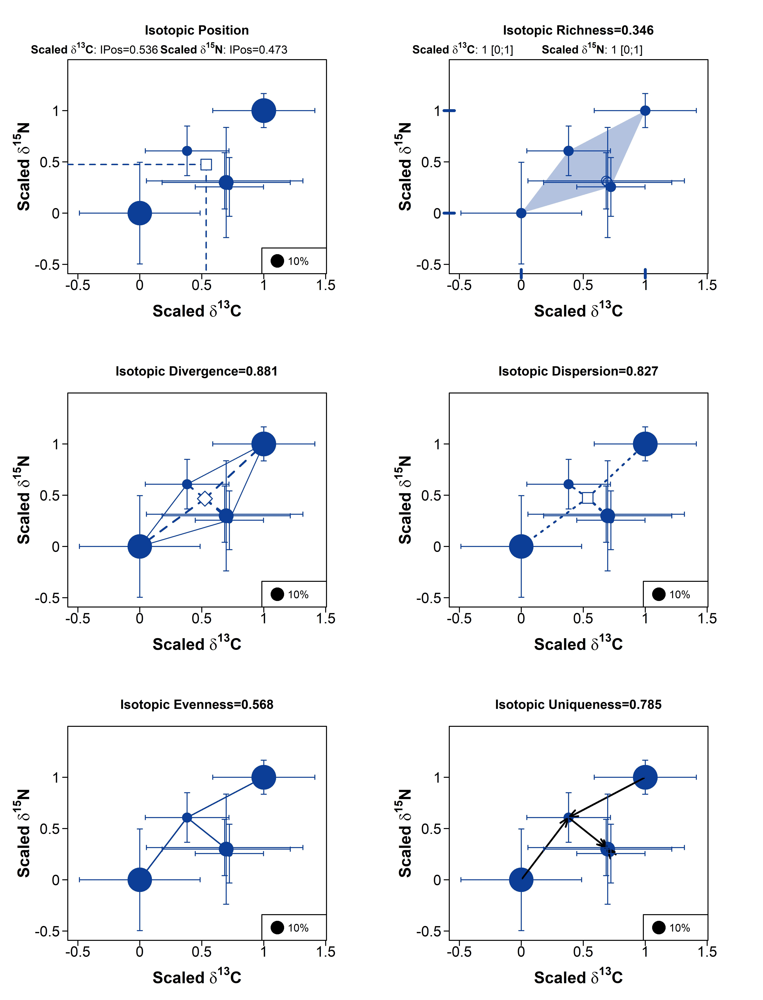{width="550"}

### Lower mesopelagic
- 715m (Z0503)
- 1000m (Z0518)


::: {.cell}

```{.r .cell-code  code-fold="true"}
individuals_si_lwm <- individuals_si%>%
  filter(station%in%c("Z0503", "Z0518"))%>%
  select(-station)

status_biomass_lwm<- species_status_biomass%>%
  filter(Status=="lower-mesopelagic")

# computing mean Stable Isotope values for each species
individuals_si_lwm<-data.frame(group=individuals_si_lwm[,"Species_code"], individuals_si_lwm)
mean_si_species_lwm<-meanSI_group(individuals_si_lwm)

# computing coefficent of variation within each species to assess intraspecific variability
cbind(CV_d13C=mean_si_species_lwm[,"sd_d13C"]/mean_si_species_lwm[,"d13C"], CV_d15N=mean_si_species_lwm[,"sd_d15N"]/mean_si_species_lwm[,"d15N"] )
```

::: {.cell-output .cell-output-stdout}
```
              CV_d13C    CV_d15N
arct-ris -0.013383792 0.02784671
argy-olf -0.010245107 0.03092443
bent-gla -0.015512985 0.06444602
cycl-otz -0.009264821 0.04946692
lamp-cro -0.020344506 0.04819340
maul-arg -0.009604780 0.03191368
sear-koe -0.022852986 0.05388211
serr-bea -0.012134196 0.06183851
xeno-cop -0.012017717 0.06196185
```
:::

```{.r .cell-code  code-fold="true"}
# building a single dataframe with all data for computing isotopic diversity indices
data_fish_lwm <-data.frame(mean_si_species_lwm[,c("d13C","d15N", "sd_d13C","sd_d15N")], rel_biomass=status_biomass_lwm[,"rel_biomass"], Status=status_biomass_lwm[,"Status"], latin_name=status_biomass_lwm[,"Species_name"])

# scaling mean stable isotopes values using function "scale_rge01"
data_fish_scl_lwm<-scaleSI_range01(data_fish_lwm)

# computing isotopic diversity of the whole fish assemblage using scaled isotopic values and species relative biomass
ID_scl_ab_lwm<-IDiversity(cons=data_fish_scl_lwm, weight=data_fish_scl_lwm[,c("rel_biomass")], nm_plot="3_lower-mesopelagic")

# printing results
result <- as.data.frame(round(ID_scl_ab_lwm,3)) 
```
:::


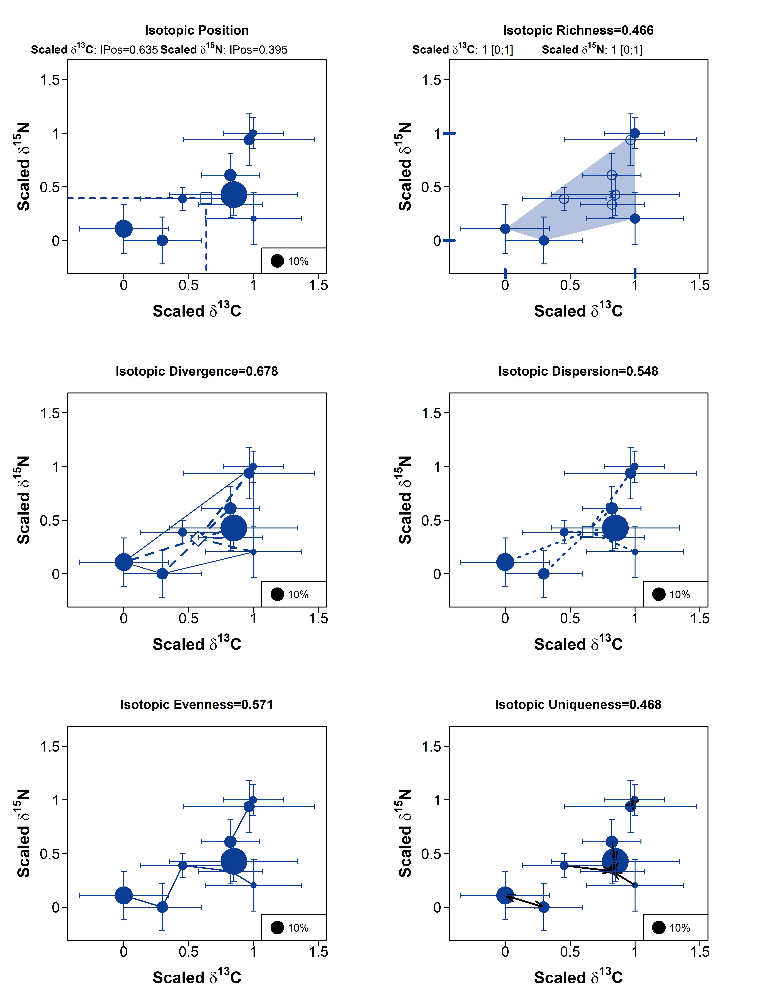{width="550"}

### Bathypelagic
- 1335m (Z0497)


::: {.cell}

```{.r .cell-code  code-fold="true"}
individuals_si_bathy <- individuals_si%>%
  filter(station=="Z0497")%>%
  select(-station)

status_biomass_bathy <- species_status_biomass%>%
  filter(Status=="bathypelagic")

# computing mean Stable Isotope values for each species
# "group" column identical to species_code to fit with input format of function meanSI_group
# no "weight" input as number of indivuals sampled per species did not mirror actual species biomass
individuals_si_bathy<-data.frame(group=individuals_si_bathy[,"Species_code"], individuals_si_bathy)
mean_si_species_bathy<-meanSI_group(individuals_si_bathy)

# computing coefficent of variation within each species to assess intraspecific variability
cbind(CV_d13C=mean_si_species_bathy[,"sd_d13C"]/mean_si_species_bathy[,"d13C"], CV_d15N=mean_si_species_bathy[,"sd_d15N"]/mean_si_species_bathy[,"d15N"] )
```

::: {.cell-output .cell-output-stdout}
```
              CV_d13C    CV_d15N
argy-olf -0.009889227 0.01043410
lamp-cro -0.018677334 0.05649516
lamp-mac -0.022058396 0.02734756
myct-pun -0.024242014 0.04136229
serr-bea -0.014132768 0.05883833
xeno-cop -0.012585074 0.05902294
```
:::

```{.r .cell-code  code-fold="true"}
# building a single dataframe with all data for computing isotopic diversity indices
data_fish_bathy <-data.frame(mean_si_species_bathy[,c("d13C","d15N", "sd_d13C","sd_d15N")], rel_biomass=status_biomass_bathy[,"rel_biomass"], Status=status_biomass_bathy[,"Status"], latin_name=status_biomass_bathy[,"Species_name"])

# scaling mean stable isotopes values using function "scale_rge01"
data_fish_scl_bathy<-scaleSI_range01(data_fish_bathy)

# computing isotopic diversity of the whole fish assemblage using scaled isotopic values and species relative biomass
ID_scl_ab_bathy<-IDiversity(cons=data_fish_scl_bathy, weight=data_fish_scl_bathy[,c("rel_biomass")], nm_plot="4_bathypelagic")

# printing results
result <- as.data.frame(round(ID_scl_ab_bathy,3)) 
```
:::


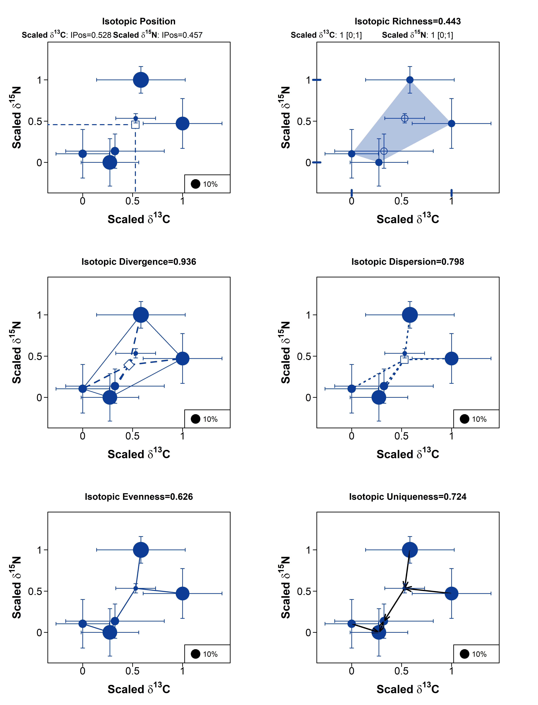{width="550"}

### Near bottom
- Z0524


::: {.cell}

```{.r .cell-code  code-fold="true"}
# 1010 Z0524 ----
individuals_si_nb <- individuals_si%>%
  filter(station=="Z0524")%>%
  select(-station)

status_biomass_nb <- species_status_biomass%>%
  filter(Status=="bottom-proximity")

# computing mean Stable Isotope values for each species
individuals_si_nb<-data.frame(group=individuals_si_nb[,"Species_code"], individuals_si_nb)
mean_si_species_nb<-meanSI_group(individuals_si_nb)

# computing coefficent of variation within each species to assess intraspecific variability
cbind(CV_d13C=mean_si_species_nb[,"sd_d13C"]/mean_si_species_nb[,"d13C"], CV_d15N=mean_si_species_nb[,"sd_d15N"]/mean_si_species_nb[,"d15N"] )
```

::: {.cell-output .cell-output-stdout}
```
              CV_d13C    CV_d15N
argy-olf -0.016533711 0.03529939
lamp-cro -0.015886548 0.04471856
mela-atl -0.009854421 0.04078758
serr-bea -0.012700557 0.05654679
xeno-cop -0.009943149 0.04105076
```
:::

```{.r .cell-code  code-fold="true"}
# building a single dataframe with all data for computing isotopic diversity indices
data_fish_nb <-data.frame(mean_si_species_nb[,c("d13C","d15N", "sd_d13C","sd_d15N")], rel_biomass=status_biomass_nb[,"rel_biomass"], Status=status_biomass_nb[,"Status"], latin_name=status_biomass_nb[,"Species_name"])

# scaling mean stable isotopes values using function "scale_rge01"
data_fish_scl_nb<-scaleSI_range01(data_fish_nb)

# computing isotopic diversity of the whole fish assemblage using scaled isotopic values and species relative biomass
ID_scl_ab_nb<-IDiversity(cons=data_fish_scl_nb, weight=data_fish_scl_nb[,c("rel_biomass")], nm_plot="5_near_bottom")

# printing results
result <- as.data.frame(round(ID_scl_ab_nb,3)) 
```
:::


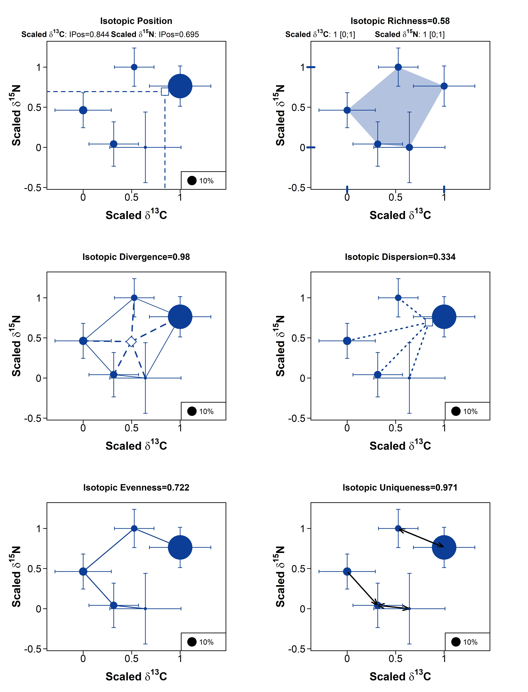{width="550"}

## Spider web


::: {.cell}

```{.r .cell-code  code-fold="true"}
# load library
library(tidyr)

# crate a data frame with all index value
trophic_indices <- data.frame(
  group = c("25m", "370m", "555m", "715m", "1000m", "1335m", "1010m-bottom proximity"),
  IDiv = c(0.952, 0.918, 0.845, 0.928, 0.721, 0.932, 0.994),
  IDis = c(0.898, 0.620, 0.466, 0.621, 0.451, 0.755, 0.318),
  IEve= c(0.46, 0.713, 0.789, 0.644, 0.58, 0.633, 0.543), 
  IUni =c(0.566,0.884, 0.833, 0.599, 0.73, 0.713, 0.758))%>%
  mutate(across(group, factor, levels=c("25m", "370m", "555m", "715m", "1000m", "1335m", "1010m-bottom proximity")))

# plot 
ggradar::ggradar(trophic_indices,
                 values.radar = c("0", "0.5", "1"),
                 group.colours ="#004291", group.line.width = 1,
                 axis.label.size= 4, group.point.size = 3,
                 grid.label.size = 4)+
  facet_wrap(~group)+
  theme_minimal()+
  theme(strip.text.x = element_text(size=12, face = "bold"),
        plot.background = element_rect(colour = "white"))+
  guides(col="none")
```

::: {.cell-output-display}
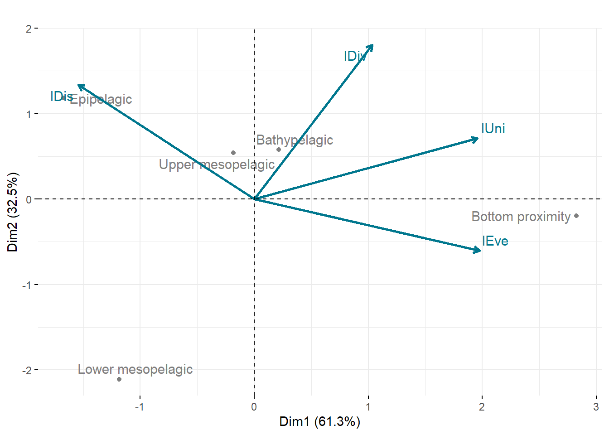{width=960}
:::

```{.r .cell-code  code-fold="true"}
#ggsave("spider_web.png", path = "figures", dpi = 700)

# spider web for each station 
# for (i in 1:7) {
#  print(ggradar::ggradar(trophic_indices[i,],
#                  values.radar = c("0", "0.5", "1"),
#                  group.colours ="#0c3d97",  group.line.width = 1.3,
#                  axis.label.size= 4, group.point.size = 5,
#                  grid.label.size = 4)+
#   facet_wrap(~group)+
#   theme_light()+
#   theme(strip.text.x = element_text(size=12, face = "bold"))+
#   guides(col="none"))
# }
```
:::

::: {.cell}

```{.r .cell-code}
htmltools::tagList(DT::datatable(trophic_indices))
```

::: {.cell-output-display}

```{=html}
<div class="datatables html-widget html-fill-item-overflow-hidden html-fill-item" id="htmlwidget-9e4ff18c96d8908ba38f" style="width:100%;height:auto;"></div>
<script type="application/json" data-for="htmlwidget-9e4ff18c96d8908ba38f">{"x":{"filter":"none","vertical":false,"data":[["1","2","3","4","5","6","7"],["25m","370m","555m","715m","1000m","1335m","1010m-bottom proximity"],[0.952,0.918,0.845,0.928,0.721,0.9320000000000001,0.994],[0.898,0.62,0.466,0.621,0.451,0.755,0.318],[0.46,0.713,0.789,0.644,0.58,0.633,0.543],[0.5659999999999999,0.884,0.833,0.599,0.73,0.713,0.758]],"container":"<table class=\"display\">\n  <thead>\n    <tr>\n      <th> <\/th>\n      <th>group<\/th>\n      <th>IDiv<\/th>\n      <th>IDis<\/th>\n      <th>IEve<\/th>\n      <th>IUni<\/th>\n    <\/tr>\n  <\/thead>\n<\/table>","options":{"columnDefs":[{"className":"dt-right","targets":[2,3,4,5]},{"orderable":false,"targets":0}],"order":[],"autoWidth":false,"orderClasses":false}},"evals":[],"jsHooks":[]}</script>
```

:::
:::


# 6.additional analyses

## Isotopic niches by sations


::: {.cell}

```{.r .cell-code  code-fold="true"}
# colors selection 
nichecol <- c("#E4A33A", "#F67451", "#D664BE", "#3DA5D9", "#94b3ae",
              "#18206F", "#FD151B", "#049A8F", "#072AC8", "purple", 
              "#d193f7", "#d8c2ab", "#678FCB", "#A63A49", "#00547A", "#6B54A0")

# plot
ggplot(data = isotope_data_fish, 
                         aes(x = d13c, 
                             y = d15n)) + 
  facet_wrap(~factor(trawling_depth))+
  geom_point(aes(color = species), alpha=0.7, size=1) +
  scale_color_manual(values=nichecol)+  
  scale_fill_manual(values=nichecol)+
  scale_x_continuous(expression({delta}^13*C~'\u2030')) +
  scale_y_continuous(expression({delta}^15*N~'\u2030'))+
  stat_ellipse(aes(group = species, fill = species, color = species), 
               alpha = 0.2, level = p.ell,linewidth = 0.7, type = "norm", geom = "polygon")+
  theme_light()+
  theme(legend.text = element_text(size=10),
        legend.title = element_text(size=10),
        axis.title = element_text(size=10),
        axis.text = element_text(size=10))+
  labs(shape="Taxon", col= "Species", fill="Species")
```

::: {.cell-output-display}
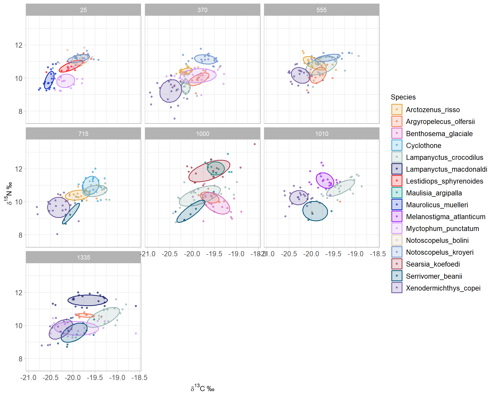{width=960}
:::

```{.r .cell-code  code-fold="true"}
#ggsave("niches_stations.png", path = "figures", dpi = 700, height = 8, width = 10)
```
:::


## Krill data

-   Total $\delta$<sup>15</sup>N variability = 0.76‰
-   Total $\delta$<sup>13</sup>C variability = 1.1‰


::: {.cell}

```{.r .cell-code  code-fold="true"}
# Load data
isotope_data <-  utils::read.csv(here::here("data", "isotopic_data_2021.csv"), sep = ";", header = T,dec = ",")
isotope_data_krill <- isotope_data %>% filter (species == "Meganyctiphanes_norvegica")

first_plot <- ggplot(data = isotope_data_krill, aes(x = d13c, y = d15n)) + 
  geom_point(aes(color= factor(trawling_depth)), size = 3) +
  ylab(expression(paste(delta^{15}, "N (\u2030)"))) +
  xlab(expression(paste(delta^{13}, "C (\u2030)"))) + 
  theme(text = element_text(size=16)) + 
  theme_light()+
  paletteer::scale_color_paletteer_d("rcartocolor::Teal")

# Summarise By depth 
data_krill_sum <- isotope_data_krill %>% 
  group_by(trawling_depth) %>% 
  summarise(count = n(),
            mC = mean(d13c), 
            sdC = sd(d13c), 
            mN = mean(d15n), 
            sdN = sd(d15n))

second_plot <- first_plot +
  geom_errorbar(data = data_krill_sum,
                mapping = aes(x = mC, y = mN, ymin = mN - 1.96*sdN, ymax = mN + 1.96*sdN, col = factor(trawling_depth)), 
                width = 0, size=0.8) +
  geom_errorbarh(data = data_krill_sum, 
                 mapping = aes(x = mC, y = mN,xmin = mC - 1.96*sdC, xmax = mC + 1.96*sdC, col = factor(trawling_depth)),
                 height = 0, size=0.8) + 
  geom_point(data = data_krill_sum, 
             aes(x = mC, y = mN, fill = factor(trawling_depth),col = factor(trawling_depth), shape = factor(trawling_depth)),
             size = 5) +
  scale_shape_manual(values = c(21, 22, 23, 24, 25, 8, 7))+
  paletteer::scale_fill_paletteer_d("rcartocolor::Teal")+
  paletteer::scale_color_paletteer_d("rcartocolor::Teal")+
  labs(shape="Trawling depth (m)", col="Trawling depth (m)", fill= "Trawling depth (m)" )

print(second_plot)
```

::: {.cell-output-display}
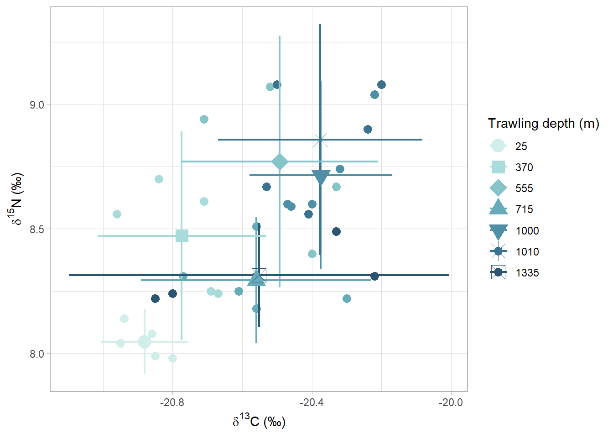{width=672}
:::
:::


### Isotope variability


::: {.cell}

```{.r .cell-code  code-fold="true"}
boxplot_d13c <- ggpubr::ggboxplot(isotope_data_krill , x = "trawling_depth", y = "d13c", 
          color = "trawling_depth",fill = "trawling_depth", alpha=0.3,
          ylab = "d13c", xlab = "trawling_depth")+
  ylab(expression(paste(delta^{13}, "C (\u2030)"))) +
  xlab("Trawling depth (m)")+
  paletteer::scale_fill_paletteer_d("rcartocolor::Teal")+
  paletteer::scale_color_paletteer_d("rcartocolor::Teal")+
  guides(fill="none", col="none" ,alpha="none")+
  theme_light()

boxplot_d15n <- ggpubr::ggboxplot(isotope_data_krill , x = "trawling_depth", y = "d15n", 
                  color = "trawling_depth", fill = "trawling_depth",
                  alpha=0.3) +
  ylab(expression(paste(delta^{15}, "N (\u2030)"))) +
  xlab("Trawling depth (m)")+
  paletteer::scale_fill_paletteer_d("rcartocolor::Teal")+
  paletteer::scale_color_paletteer_d("rcartocolor::Teal")+
  guides(fill="none", col="none" ,alpha="none")+
  theme_light()

ggpubr::ggarrange(boxplot_d13c, boxplot_d15n)
```

::: {.cell-output-display}
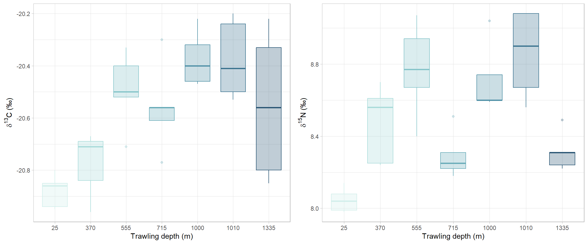{width=1152}
:::
:::


### Tests


::: {.cell}

```{.r .cell-code  code-fold="true"}
pairwise.wilcox.test(isotope_data_krill$d13c, isotope_data_krill$trawling_depth,
                 p.adjust.method = "BH")
```

::: {.cell-output .cell-output-stdout}
```

	Pairwise comparisons using Wilcoxon rank sum exact test 

data:  isotope_data_krill$d13c and isotope_data_krill$trawling_depth 

     25    370   555   715   1000  1010 
370  0.359 -     -     -     -     -    
555  0.033 0.122 -     -     -     -    
715  0.042 0.125 0.497 -     -     -    
1000 0.033 0.033 0.303 0.179 -     -    
1010 0.033 0.033 0.541 0.125 0.883 -    
1335 0.107 0.433 0.833 1.000 0.454 0.433

P value adjustment method: BH 
```
:::

```{.r .cell-code  code-fold="true"}
pairwise.wilcox.test(isotope_data_krill$d15n, isotope_data_krill$trawling_depth,
                 p.adjust.method = "BH")
```

::: {.cell-output .cell-output-stdout}
```

	Pairwise comparisons using Wilcoxon rank sum exact test 

data:  isotope_data_krill$d15n and isotope_data_krill$trawling_depth 

     25    370   555   715   1000  1010 
370  0.025 -     -     -     -     -    
555  0.025 0.143 -     -     -     -    
715  0.025 0.243 0.030 -     -     -    
1000 0.025 0.274 0.585 0.025 -     -    
1010 0.025 0.120 0.629 0.025 0.467 -    
1335 0.025 0.306 0.037 0.750 0.025 0.025

P value adjustment method: BH 
```
:::
:::
