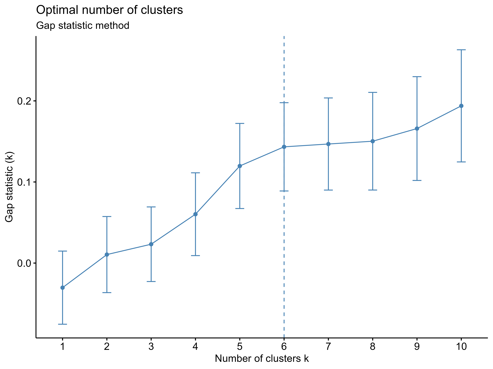
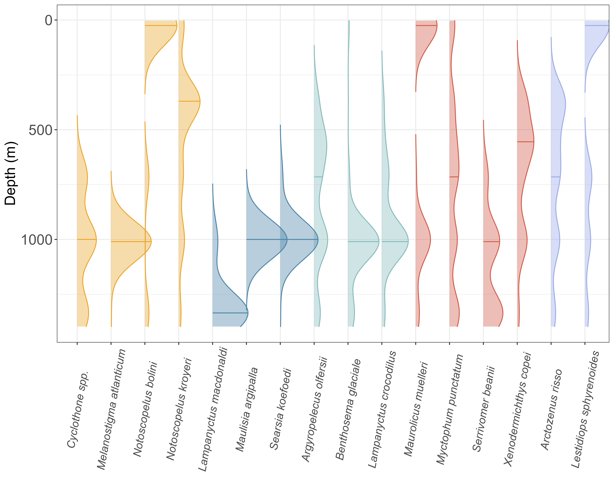
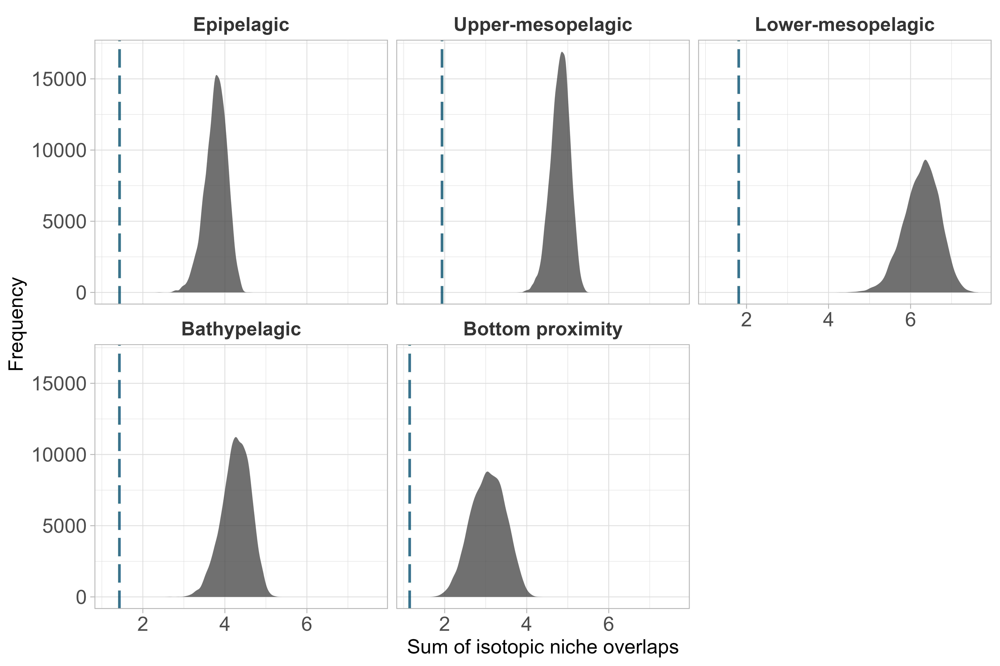

# 1. Workflow 
- You can use the scroll wheel to zoom in on the graph to view a specific element. 

::: {.cell}

```{.r .cell-code}
library(dplyr)
targets::tar_visnetwork()
```

::: {.cell-output .cell-output-stdout}
```
Le chargement a nécessité le package : geometry
Le chargement a nécessité le package : ape
Le chargement a nécessité le package : rcdd
If you want correct answers, use rational arithmetic.
See the Warnings sections in help pages for
    functions that do computational geometry.
```
:::

::: {.cell-output-display}

```{=html}
<div class="visNetwork html-widget html-fill-item" id="htmlwidget-5cacd249fa871e83ac78" style="width:100%;height:464px;"></div>
<script type="application/json" data-for="htmlwidget-5cacd249fa871e83ac78">{"x":{"nodes":{"name":["cluster_definition","dendrogram","density_distribution_data","depth_distribution","diversity_index","individuals_si","isotope_data_fish","median_depth","nb_cluster_gs","niche_area_sp","niche_cluster","overlap_mx","overlap_sp","PCA","plot_matrix","Species_code","species_niche","species_status_biomass","trawling_data","nm_si","sum_overlap","niche_area","overlap_matrix_plot","overlap_matrix","isotopic_space","density_distrubtion","nb_cluster","niche_plot_community","meansexy","plot_densdrogram","compute_PCA","k_means_cluster","individuals_si_format","depth_distribution_plot","median_depth_sp","sp_status_biomass_format","plot_niche_cluster","meanSI_group","scaleSI_range01","sum_overlap_boot","niche_area_boot","IDiversity","null_model_overlap","null_model_niche_area","diversity_index_calculation"],"type":["stem","stem","stem","stem","stem","stem","stem","stem","stem","stem","stem","stem","stem","stem","stem","stem","stem","stem","stem","object","function","function","function","function","function","function","function","function","function","function","function","function","function","function","function","function","function","function","function","function","function","function","function","function","function"],"description":[null,null,null,null,null,null,null,null,null,null,null,null,null,null,null,null,null,null,null,null,null,null,null,null,null,null,null,null,null,null,null,null,null,null,null,null,null,null,null,null,null,null,null,null,null],"status":["uptodate","uptodate","uptodate","uptodate","uptodate","uptodate","uptodate","uptodate","uptodate","uptodate","uptodate","uptodate","uptodate","uptodate","uptodate","uptodate","uptodate","uptodate","uptodate","uptodate","uptodate","uptodate","uptodate","uptodate","uptodate","uptodate","uptodate","uptodate","uptodate","uptodate","uptodate","uptodate","uptodate","uptodate","uptodate","uptodate","uptodate","uptodate","uptodate","uptodate","uptodate","uptodate","uptodate","uptodate","uptodate"],"seconds":[0,0.47,0.64,2.89,9.619999999999999,0.06,0.47,0,2.85,2223.26,2.14,5.4,47249.3,2.45,1.47,0,2.15,0.07000000000000001,0.23,null,null,null,null,null,null,null,null,null,null,null,null,null,null,null,null,null,null,null,null,null,null,null,null,null,null],"bytes":[385,83,1029,77,609,6457,15653,437,75,85,79,804,83,68,79,462,81,1097,2137,null,null,null,null,null,null,null,null,null,null,null,null,null,null,null,null,null,null,null,null,null,null,null,null,null,null],"branches":[null,null,null,null,null,null,null,null,null,null,null,null,null,null,null,null,null,null,null,null,null,null,null,null,null,null,null,null,null,null,null,null,null,null,null,null,null,null,null,null,null,null,null,null,null],"label":["cluster_definition","dendrogram","density_distribution_data","depth_distribution","diversity_index","individuals_si","isotope_data_fish","median_depth","nb_cluster_gs","niche_area_sp","niche_cluster","overlap_mx","overlap_sp","PCA","plot_matrix","Species_code","species_niche","species_status_biomass","trawling_data","nm_si","sum_overlap","niche_area","overlap_matrix_plot","overlap_matrix","isotopic_space","density_distrubtion","nb_cluster","niche_plot_community","meansexy","plot_densdrogram","compute_PCA","k_means_cluster","individuals_si_format","depth_distribution_plot","median_depth_sp","sp_status_biomass_format","plot_niche_cluster","meanSI_group","scaleSI_range01","sum_overlap_boot","niche_area_boot","IDiversity","null_model_overlap","null_model_niche_area","diversity_index_calculation"],"color":["#354823","#354823","#354823","#354823","#354823","#354823","#354823","#354823","#354823","#354823","#354823","#354823","#354823","#354823","#354823","#354823","#354823","#354823","#354823","#354823","#354823","#354823","#354823","#354823","#354823","#354823","#354823","#354823","#354823","#354823","#354823","#354823","#354823","#354823","#354823","#354823","#354823","#354823","#354823","#354823","#354823","#354823","#354823","#354823","#354823"],"id":["cluster_definition","dendrogram","density_distribution_data","depth_distribution","diversity_index","individuals_si","isotope_data_fish","median_depth","nb_cluster_gs","niche_area_sp","niche_cluster","overlap_mx","overlap_sp","PCA","plot_matrix","Species_code","species_niche","species_status_biomass","trawling_data","nm_si","sum_overlap","niche_area","overlap_matrix_plot","overlap_matrix","isotopic_space","density_distrubtion","nb_cluster","niche_plot_community","meansexy","plot_densdrogram","compute_PCA","k_means_cluster","individuals_si_format","depth_distribution_plot","median_depth_sp","sp_status_biomass_format","plot_niche_cluster","meanSI_group","scaleSI_range01","sum_overlap_boot","niche_area_boot","IDiversity","null_model_overlap","null_model_niche_area","diversity_index_calculation"],"level":[3,3,2,4,4,3,1,3,3,4,2,2,4,5,3,1,2,2,1,1,1,1,1,1,1,1,1,1,1,1,1,1,1,1,1,1,1,2,2,2,2,2,3,3,3],"shape":["dot","dot","dot","dot","dot","dot","dot","dot","dot","dot","dot","dot","dot","dot","dot","dot","dot","dot","dot","triangleDown","triangle","triangle","triangle","triangle","triangle","triangle","triangle","triangle","triangle","triangle","triangle","triangle","triangle","triangle","triangle","triangle","triangle","triangle","triangle","triangle","triangle","triangle","triangle","triangle","triangle"]},"edges":{"from":["nm_si","nm_si","nm_si","meanSI_group","sum_overlap","sum_overlap","sum_overlap_boot","scaleSI_range01","niche_area","niche_area","IDiversity","isotopic_space","niche_area_boot","meansexy","isotope_data_fish","plot_niche_cluster","nb_cluster","overlap_mx","isotope_data_fish","null_model_overlap","diversity_index_calculation","individuals_si","species_status_biomass","overlap_matrix_plot","overlap_mx","compute_PCA","diversity_index","individuals_si_format","isotope_data_fish","Species_code","species_status_biomass","sp_status_biomass_format","Species_code","trawling_data","k_means_cluster","overlap_mx","density_distribution_data","median_depth_sp","isotope_data_fish","niche_plot_community","density_distrubtion","trawling_data","isotope_data_fish","overlap_matrix","overlap_mx","plot_densdrogram","cluster_definition","density_distribution_data","depth_distribution_plot","isotope_data_fish","null_model_niche_area"],"to":["meanSI_group","scaleSI_range01","IDiversity","diversity_index_calculation","sum_overlap_boot","null_model_overlap","null_model_overlap","diversity_index_calculation","niche_area_boot","null_model_niche_area","diversity_index_calculation","IDiversity","null_model_niche_area","IDiversity","niche_cluster","niche_cluster","nb_cluster_gs","nb_cluster_gs","overlap_sp","overlap_sp","diversity_index","diversity_index","diversity_index","plot_matrix","plot_matrix","PCA","PCA","individuals_si","individuals_si","individuals_si","individuals_si","species_status_biomass","species_status_biomass","species_status_biomass","cluster_definition","cluster_definition","median_depth","median_depth","species_niche","species_niche","density_distribution_data","density_distribution_data","overlap_mx","overlap_mx","dendrogram","dendrogram","depth_distribution","depth_distribution","depth_distribution","niche_area_sp","niche_area_sp"],"arrows":["to","to","to","to","to","to","to","to","to","to","to","to","to","to","to","to","to","to","to","to","to","to","to","to","to","to","to","to","to","to","to","to","to","to","to","to","to","to","to","to","to","to","to","to","to","to","to","to","to","to","to"]},"nodesToDataframe":true,"edgesToDataframe":true,"options":{"width":"100%","height":"100%","nodes":{"shape":"dot","physics":false},"manipulation":{"enabled":false},"edges":{"smooth":{"type":"cubicBezier","forceDirection":"horizontal"}},"physics":{"stabilization":false},"interaction":{"zoomSpeed":1},"layout":{"hierarchical":{"enabled":true,"direction":"LR"}}},"groups":null,"width":null,"height":null,"idselection":{"enabled":false,"style":"width: 150px; height: 26px","useLabels":true,"main":"Select by id"},"byselection":{"enabled":false,"style":"width: 150px; height: 26px","multiple":false,"hideColor":"rgba(200,200,200,0.5)","highlight":false},"main":{"text":"","style":"font-family:Georgia, Times New Roman, Times, serif;font-weight:bold;font-size:20px;text-align:center;"},"submain":null,"footer":null,"background":"rgba(0, 0, 0, 0)","highlight":{"enabled":true,"hoverNearest":false,"degree":{"from":1,"to":1},"algorithm":"hierarchical","hideColor":"rgba(200,200,200,0.5)","labelOnly":true},"collapse":{"enabled":true,"fit":false,"resetHighlight":true,"clusterOptions":null,"keepCoord":true,"labelSuffix":"(cluster)"},"legend":{"width":0.2,"useGroups":false,"position":"right","ncol":1,"stepX":100,"stepY":100,"zoom":true,"nodes":{"label":["Up to date","Stem","Object","Function"],"color":["#354823","#899DA4","#899DA4","#899DA4"],"shape":["dot","dot","triangleDown","triangle"]},"nodesToDataframe":true},"tooltipStay":300,"tooltipStyle":"position: fixed;visibility:hidden;padding: 5px;white-space: nowrap;font-family: verdana;font-size:14px;font-color:#000000;background-color: #f5f4ed;-moz-border-radius: 3px;-webkit-border-radius: 3px;border-radius: 3px;border: 1px solid #808074;box-shadow: 3px 3px 10px rgba(0, 0, 0, 0.2);"},"evals":[],"jsHooks":[]}</script>
```

:::
:::


# 2. Data
- summary of $\delta$<sup>13</sup>C and $\delta$<sup>15</sup>N data by species

::: {.cell}

```{.r .cell-code  code-fold="true"}
isotope_data <- targets::tar_read(isotope_data_fish) %>%
  as.data.frame() %>%
  select(species, d15n, d13c) %>%
  group_by(species) %>%
  summarise(
    n = n(),
    mean_d15N = round(mean(d15n), 2),
    sd_d15N = round(sd(d15n), 2),
    mean_d13C = round(mean(d13c), 2),
    sd_d13C = round(sd(d13c), 2)
  )

htmltools::tagList(DT::datatable(isotope_data))
```

::: {.cell-output-display}

```{=html}
<div class="datatables html-widget html-fill-item" id="htmlwidget-8ad53d7af00c7c4188cd" style="width:100%;height:auto;"></div>
<script type="application/json" data-for="htmlwidget-8ad53d7af00c7c4188cd">{"x":{"filter":"none","vertical":false,"data":[["1","2","3","4","5","6","7","8","9","10","11","12","13","14","15","16"],["Arctozenus risso","Argyropelecus olfersii","Benthosema glaciale","Cyclothone","Lampanyctus crocodilus","Lampanyctus macdonaldi","Lestidiops sphyrenoides","Maulisia argipalla","Maurolicus muelleri","Melanostigma atlanticum","Myctophum punctatum","Notoscopelus bolini","Notoscopelus kroyeri","Searsia koefoedi","Serrivomer beanii","Xenodermichthys copei"],[43,42,20,20,120,20,12,14,20,20,57,20,60,14,26,97],[10.52,10.13,9.91,10.98,10.42,11.52,10.72,12.01,9.869999999999999,11.28,9.92,11.13,11.17,11.85,9.470000000000001,9.800000000000001],[0.35,0.53,0.64,0.54,0.67,0.32,0.35,0.38,0.52,0.46,0.42,0.31,0.25,0.64,0.55,0.67],[-20.01,-19.75,-19.46,-19.61,-19.56,-19.67,-20.02,-19.46,-20.55,-19.7,-19.99,-19.83,-19.73,-19.49,-19.99,-20.27],[0.23,0.22,0.3,0.18,0.43,0.43,0.22,0.19,0.11,0.2,0.39,0.18,0.27,0.41,0.26,0.29]],"container":"<table class=\"display\">\n  <thead>\n    <tr>\n      <th> <\/th>\n      <th>species<\/th>\n      <th>n<\/th>\n      <th>mean_d15N<\/th>\n      <th>sd_d15N<\/th>\n      <th>mean_d13C<\/th>\n      <th>sd_d13C<\/th>\n    <\/tr>\n  <\/thead>\n<\/table>","options":{"columnDefs":[{"className":"dt-right","targets":[2,3,4,5,6]},{"orderable":false,"targets":0},{"name":" ","targets":0},{"name":"species","targets":1},{"name":"n","targets":2},{"name":"mean_d15N","targets":3},{"name":"sd_d15N","targets":4},{"name":"mean_d13C","targets":5},{"name":"sd_d13C","targets":6}],"order":[],"autoWidth":false,"orderClasses":false}},"evals":[],"jsHooks":[]}</script>
```

:::
:::


# 3. Isotopic niches 

## Ellipses 

-   Standard ellipses at 40% of the 16 fish species with all sampling depths combined
-   Δ $\delta$<sup>13</sup>C = 2.36‰
-   Δ $\delta$<sup>15</sup>N = 5.94‰


::: {.cell}

```{.r .cell-code  code-fold="true"}
targets::tar_load(species_niche)
knitr::include_graphics(species_niche)
```

::: {.cell-output-display}

:::
:::


## Overlaps

- Asymmetric matrix of isotopic niche overlap between the different species sampled at all sampling depths combined. The isotopic niche was estimated using a 40% ellipse. The overlap values lie between 1 (i.e. the niche of species 1 at the bottom of the matrix is completely covered by the niche of species 2 on the left of the matrix) and 0 (i.e., the niches of the two species are completely separate).

::: {.cell}

```{.r .cell-code  code-fold="true"}
targets::tar_load(plot_matrix)
knitr::include_graphics(plot_matrix)
```

::: {.cell-output-display}

:::
:::


# 4. Depth segregation

## Clusters
-   input data for clusters = overlap matrix

::: {.cell}

```{.r .cell-code  code-fold="true"}
targets::tar_load(nb_cluster_gs)
knitr::include_graphics(nb_cluster_gs)
```

::: {.cell-output-display}

:::
:::


- It is not ecologically relevant for a species to be alone in its cluster, so 5 clusters are selected. 

::: {.cell}

```{.r .cell-code  code-fold="true"}
cluster <- targets::tar_read(cluster_definition) 

htmltools::tagList(DT::datatable(cluster))
```

::: {.cell-output-display}

```{=html}
<div class="datatables html-widget html-fill-item" id="htmlwidget-50914d8c12b52788201b" style="width:100%;height:auto;"></div>
<script type="application/json" data-for="htmlwidget-50914d8c12b52788201b">{"x":{"filter":"none","vertical":false,"data":[["1","2","3","4","5","6","7","8","9","10","11","12","13","14","15","16"],["Serrivomer beanii","Xenodermichthys copei","Maurolicus muelleri","Benthosema glaciale","Myctophum punctatum","Argyropelecus olfersii","Lampanyctus crocodilus","Arctozenus risso","Lestidiops sphyrenoides","Cyclothone spp.","Notoscopelus bolini","Notoscopelus kroyeri","Melanostigma atlanticum","Lampanyctus macdonaldi","Searsia koefoedi","Maulisia argipalla"],[4,4,4,3,4,3,3,5,5,1,1,1,1,2,2,2]],"container":"<table class=\"display\">\n  <thead>\n    <tr>\n      <th> <\/th>\n      <th>species<\/th>\n      <th>cluster<\/th>\n    <\/tr>\n  <\/thead>\n<\/table>","options":{"columnDefs":[{"className":"dt-right","targets":2},{"orderable":false,"targets":0},{"name":" ","targets":0},{"name":"species","targets":1},{"name":"cluster","targets":2}],"order":[],"autoWidth":false,"orderClasses":false}},"evals":[],"jsHooks":[]}</script>
```

:::
:::


## Depth distribution
- From complete 2021 trawling data (not only individuals sampled for isotopic analyses)

::: {.cell}

```{.r .cell-code  code-fold="true"}
targets::tar_load(depth_distribution)
knitr::include_graphics(depth_distribution)
```

::: {.cell-output-display}

:::
:::


# 5. Null models

## Isotopic species niche size
- Comparison of the isotopic niche area of each species in the different depth layers. Density plots represented the distributions of the estimated isotopic niche area based on the resampling of isotopic values (i.e. null model). The actual niche of each species is represented by the dotted vertical line

::: {.cell}

```{.r .cell-code  code-fold="true"}
targets::tar_load(niche_area_sp)
knitr::include_graphics(niche_area_sp)
```

::: {.cell-output-display}

:::
:::


## Sum of isotopic niche overlaps 
- Comparison of cumulative isotopic niche overlap standardized by the number of species in each depth layer. The distributions represent the cumulative overlap of isotopic niches based on the resampling of isotopic values (i.e., null model). The dashed lines represent the cumulative isotopic niche overlap observed in each depth layer.

::: {.cell}

```{.r .cell-code  code-fold="true"}
targets::tar_load(overlap_sp)
knitr::include_graphics(overlap_sp)
```

::: {.cell-output-display}

:::
:::


# 6. Isotopic diversity index 

- __IDiv__ = divergence, __IDis__ = dispersion, __IEve__ = evenness and __IUni__ = uniqueness

::: {.cell}

```{.r .cell-code  code-fold="true"}
diversity_index <- targets::tar_read(diversity_index) %>%
  filter(index %in% c("IDiv", "IDis", "IEve", "IUni")) %>%
  mutate(ID_scl_ab = round(ID_scl_ab, 4)) %>% 
  tidyr::pivot_wider(names_from = index, values_from = ID_scl_ab)

htmltools::tagList(DT::datatable(diversity_index))
```

::: {.cell-output-display}

```{=html}
<div class="datatables html-widget html-fill-item" id="htmlwidget-4acefe20e3b46b828df7" style="width:100%;height:auto;"></div>
<script type="application/json" data-for="htmlwidget-4acefe20e3b46b828df7">{"x":{"filter":"none","vertical":false,"data":[["1","2","3","4","5"],["epipelagic","upper-mesopelagic","lower-mesopelagic","bathypelagic","bottom-proximity"],[0.9530999999999999,0.881,0.6778999999999999,0.9360000000000001,0.9802999999999999],[0.8976,0.8269,0.5484,0.798,0.3343],[0.4488,0.5683,0.5711000000000001,0.6258,0.7222],[0.5617,0.7854,0.4678,0.7238,0.9712]],"container":"<table class=\"display\">\n  <thead>\n    <tr>\n      <th> <\/th>\n      <th>Depth_Layer<\/th>\n      <th>IDiv<\/th>\n      <th>IDis<\/th>\n      <th>IEve<\/th>\n      <th>IUni<\/th>\n    <\/tr>\n  <\/thead>\n<\/table>","options":{"columnDefs":[{"className":"dt-right","targets":[2,3,4,5]},{"orderable":false,"targets":0},{"name":" ","targets":0},{"name":"Depth_Layer","targets":1},{"name":"IDiv","targets":2},{"name":"IDis","targets":3},{"name":"IEve","targets":4},{"name":"IUni","targets":5}],"order":[],"autoWidth":false,"orderClasses":false}},"evals":[],"jsHooks":[]}</script>
```

:::
:::


## PCA 

::: {.cell}

```{.r .cell-code  code-fold="true"}
targets::tar_load(PCA)
knitr::include_graphics(PCA)
```

::: {.cell-output-display}

:::
:::


# 7. Appendices 
## Appendix A 
- Standard ellipses at 40% of the trophic guilds obtained by clustering based on species $\delta$<sup>13</sup>C and $\delta$<sup>15</sup>N values

::: {.cell}

```{.r .cell-code  code-fold="true"}
targets::tar_load(niche_cluster)
knitr::include_graphics(niche_cluster)
```

::: {.cell-output-display}

:::
:::


## Appendix B
- Graphical representation of all the indices in each depth layer 
- __A__= epipelagic, __B__= upper-mesopelagic, __C__= lower-mesopelagic, __D__= bathypelagic and __E__= bottom-proximity
- __IDiv__ = divergence, __IDis__ = dispersion, __IEve__ = evenness and __IUni__ = uniqueness

::: {.cell}

```{.r .cell-code  code-fold="true"}
knitr::include_graphics("figures/isotopic_diversity_indices.png")
```

::: {.cell-output-display}

:::
:::