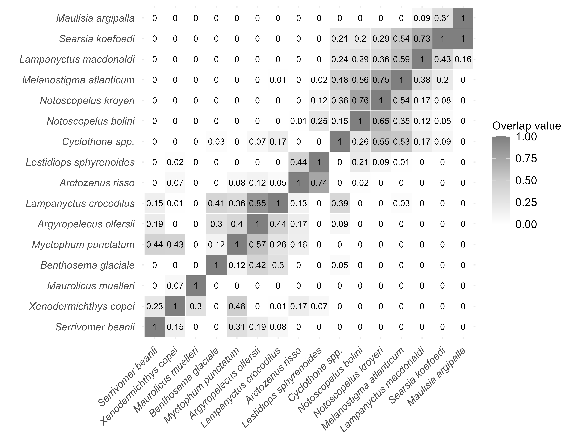

::: {.cell}

```{.r .cell-code  code-fold="true"}
targets::tar_visnetwork()
```

::: {.cell-output .cell-output-stdout}
```
Le chargement a nécessité le package : geometry
Le chargement a nécessité le package : ape
Le chargement a nécessité le package : rcdd
If you want correct answers, use rational arithmetic.
See the Warnings sections in help pages for
    functions that do computational geometry.
```
:::

::: {.cell-output-display}

```{=html}
<div class="visNetwork html-widget html-fill-item" id="htmlwidget-60974db7e35ac9d8ffb4" style="width:100%;height:464px;"></div>
<script type="application/json" data-for="htmlwidget-60974db7e35ac9d8ffb4">{"x":{"nodes":{"name":["cluster_definition","dendrogram","density_distribution_data","depth_distribution","diversity_index","individuals_si","isotope_data","median_depth","nb_cluster_gs","niche_area_sp","overlap_mx","overlap_sp","PCA","plot_matrix","species_niche","species_status_biomass","trawling_data","nm_si","sum_overlap","tit_d13C","niche_area","overlap_matrix_plot","scl_tit_dD","overlap_matrix","tit_dD","isotopic_space","density_distrubtion","nb_cluster","scl_tit_d15N","scl_tit_d34S","niche_plot_community","meansexy","plot_densdrogram","compute_PCA","scl_tit_d13C","k_means_cluster","individuals_si_format","depth_distribution_plot","median_depth_sp","tit_d15N","sp_status_biomass_format","tit_d34S","meanSI_group","scaleSI_range01","sum_overlap_boot","niche_area_boot","IDiversity","null_model_overlap","null_model_niche_area","diversity_index_calculation"],"type":["stem","stem","stem","stem","stem","stem","stem","stem","stem","stem","stem","stem","stem","stem","stem","stem","stem","object","function","object","function","function","object","function","object","function","function","function","object","object","function","function","function","function","object","function","function","function","function","object","function","object","function","function","function","function","function","function","function","function"],"status":["uptodate","uptodate","uptodate","uptodate","outdated","uptodate","uptodate","uptodate","uptodate","uptodate","uptodate","uptodate","outdated","uptodate","uptodate","uptodate","uptodate","uptodate","uptodate","uptodate","uptodate","uptodate","uptodate","uptodate","uptodate","uptodate","uptodate","uptodate","uptodate","uptodate","uptodate","uptodate","uptodate","uptodate","uptodate","uptodate","uptodate","uptodate","uptodate","uptodate","uptodate","uptodate","uptodate","uptodate","uptodate","uptodate","outdated","uptodate","uptodate","outdated"],"seconds":[0,0.1,0.43,2.31,3.77,0.03,0.22,0.02,2.57,312.92,2.84,1239.88,2.94,1.17,1.95,0.13,0.38,null,null,null,null,null,null,null,null,null,null,null,null,null,null,null,null,null,null,null,null,null,null,null,null,null,null,null,null,null,null,null,null,null],"bytes":[329,44,5117,77,609,5081,28885,437,75,83,797,82,68,79,84,1106,449254,null,null,null,null,null,null,null,null,null,null,null,null,null,null,null,null,null,null,null,null,null,null,null,null,null,null,null,null,null,null,null,null,null],"branches":[null,null,null,null,null,null,null,null,null,null,null,null,null,null,null,null,null,null,null,null,null,null,null,null,null,null,null,null,null,null,null,null,null,null,null,null,null,null,null,null,null,null,null,null,null,null,null,null,null,null],"label":["cluster_definition","dendrogram","density_distribution_data","depth_distribution","diversity_index","individuals_si","isotope_data","median_depth","nb_cluster_gs","niche_area_sp","overlap_mx","overlap_sp","PCA","plot_matrix","species_niche","species_status_biomass","trawling_data","nm_si","sum_overlap","tit_d13C","niche_area","overlap_matrix_plot","scl_tit_dD","overlap_matrix","tit_dD","isotopic_space","density_distrubtion","nb_cluster","scl_tit_d15N","scl_tit_d34S","niche_plot_community","meansexy","plot_densdrogram","compute_PCA","scl_tit_d13C","k_means_cluster","individuals_si_format","depth_distribution_plot","median_depth_sp","tit_d15N","sp_status_biomass_format","tit_d34S","meanSI_group","scaleSI_range01","sum_overlap_boot","niche_area_boot","IDiversity","null_model_overlap","null_model_niche_area","diversity_index_calculation"],"color":["#354823","#354823","#354823","#354823","#78B7C5","#354823","#354823","#354823","#354823","#354823","#354823","#354823","#78B7C5","#354823","#354823","#354823","#354823","#354823","#354823","#354823","#354823","#354823","#354823","#354823","#354823","#354823","#354823","#354823","#354823","#354823","#354823","#354823","#354823","#354823","#354823","#354823","#354823","#354823","#354823","#354823","#354823","#354823","#354823","#354823","#354823","#354823","#78B7C5","#354823","#354823","#78B7C5"],"id":["cluster_definition","dendrogram","density_distribution_data","depth_distribution","diversity_index","individuals_si","isotope_data","median_depth","nb_cluster_gs","niche_area_sp","overlap_mx","overlap_sp","PCA","plot_matrix","species_niche","species_status_biomass","trawling_data","nm_si","sum_overlap","tit_d13C","niche_area","overlap_matrix_plot","scl_tit_dD","overlap_matrix","tit_dD","isotopic_space","density_distrubtion","nb_cluster","scl_tit_d15N","scl_tit_d34S","niche_plot_community","meansexy","plot_densdrogram","compute_PCA","scl_tit_d13C","k_means_cluster","individuals_si_format","depth_distribution_plot","median_depth_sp","tit_d15N","sp_status_biomass_format","tit_d34S","meanSI_group","scaleSI_range01","sum_overlap_boot","niche_area_boot","IDiversity","null_model_overlap","null_model_niche_area","diversity_index_calculation"],"level":[3,3,2,3,4,2,1,3,3,4,2,4,5,3,2,2,1,1,1,0,1,1,0,1,0,1,1,1,0,0,1,1,1,1,0,1,1,1,1,0,1,0,2,2,2,2,2,3,3,3],"shape":["dot","dot","dot","dot","dot","dot","dot","dot","dot","dot","dot","dot","dot","dot","dot","dot","dot","triangleDown","triangle","triangleDown","triangle","triangle","triangleDown","triangle","triangleDown","triangle","triangle","triangle","triangleDown","triangleDown","triangle","triangle","triangle","triangle","triangleDown","triangle","triangle","triangle","triangle","triangleDown","triangle","triangleDown","triangle","triangle","triangle","triangle","triangle","triangle","triangle","triangle"]},"edges":{"from":["nm_si","nm_si","nm_si","meanSI_group","sum_overlap","sum_overlap","sum_overlap_boot","scaleSI_range01","niche_area","niche_area","IDiversity","isotopic_space","niche_area_boot","meansexy","nb_cluster","overlap_mx","isotope_data","null_model_overlap","diversity_index_calculation","individuals_si","species_status_biomass","overlap_matrix_plot","overlap_mx","compute_PCA","diversity_index","sp_status_biomass_format","trawling_data","individuals_si_format","isotope_data","k_means_cluster","overlap_mx","density_distribution_data","median_depth_sp","isotope_data","niche_plot_community","density_distrubtion","trawling_data","isotope_data","overlap_matrix","overlap_mx","plot_densdrogram","density_distribution_data","depth_distribution_plot","isotope_data","null_model_niche_area"],"to":["meanSI_group","scaleSI_range01","IDiversity","diversity_index_calculation","sum_overlap_boot","null_model_overlap","null_model_overlap","diversity_index_calculation","niche_area_boot","null_model_niche_area","diversity_index_calculation","IDiversity","null_model_niche_area","IDiversity","nb_cluster_gs","nb_cluster_gs","overlap_sp","overlap_sp","diversity_index","diversity_index","diversity_index","plot_matrix","plot_matrix","PCA","PCA","species_status_biomass","species_status_biomass","individuals_si","individuals_si","cluster_definition","cluster_definition","median_depth","median_depth","species_niche","species_niche","density_distribution_data","density_distribution_data","overlap_mx","overlap_mx","dendrogram","dendrogram","depth_distribution","depth_distribution","niche_area_sp","niche_area_sp"],"arrows":["to","to","to","to","to","to","to","to","to","to","to","to","to","to","to","to","to","to","to","to","to","to","to","to","to","to","to","to","to","to","to","to","to","to","to","to","to","to","to","to","to","to","to","to","to"]},"nodesToDataframe":true,"edgesToDataframe":true,"options":{"width":"100%","height":"100%","nodes":{"shape":"dot","physics":false},"manipulation":{"enabled":false},"edges":{"smooth":{"type":"cubicBezier","forceDirection":"horizontal"}},"physics":{"stabilization":false},"interaction":{"zoomSpeed":1},"layout":{"hierarchical":{"enabled":true,"direction":"LR"}}},"groups":null,"width":null,"height":null,"idselection":{"enabled":false,"style":"width: 150px; height: 26px","useLabels":true,"main":"Select by id"},"byselection":{"enabled":false,"style":"width: 150px; height: 26px","multiple":false,"hideColor":"rgba(200,200,200,0.5)","highlight":false},"main":{"text":"","style":"font-family:Georgia, Times New Roman, Times, serif;font-weight:bold;font-size:20px;text-align:center;"},"submain":null,"footer":null,"background":"rgba(0, 0, 0, 0)","highlight":{"enabled":true,"hoverNearest":false,"degree":{"from":1,"to":1},"algorithm":"hierarchical","hideColor":"rgba(200,200,200,0.5)","labelOnly":true},"collapse":{"enabled":true,"fit":false,"resetHighlight":true,"clusterOptions":null,"keepCoord":true,"labelSuffix":"(cluster)"},"legend":{"width":0.2,"useGroups":false,"position":"right","ncol":1,"stepX":100,"stepY":100,"zoom":true,"nodes":{"label":["Up to date","Outdated","Stem","Object","Function"],"color":["#354823","#78B7C5","#899DA4","#899DA4","#899DA4"],"shape":["dot","dot","dot","triangleDown","triangle"]},"nodesToDataframe":true},"tooltipStay":300,"tooltipStyle":"position: fixed;visibility:hidden;padding: 5px;white-space: nowrap;font-family: verdana;font-size:14px;font-color:#000000;background-color: #f5f4ed;-moz-border-radius: 3px;-webkit-border-radius: 3px;border-radius: 3px;border: 1px solid #808074;box-shadow: 3px 3px 10px rgba(0, 0, 0, 0.2);"},"evals":[],"jsHooks":[]}</script>
```

:::
:::


# 1. Isotopic species niche

## Community

::: {.cell}

```{.r .cell-code  code-fold="true"}
targets::tar_read(species_niche)
```

::: {.cell-output .cell-output-stdout}
```
[1] "figures/niches_community_col.png"
```
:::

```{.r .cell-code  code-fold="true"}
knitr::include_graphics("figures/niches_community_col.png")
```

::: {.cell-output-display}
{width=4200}
:::
:::


## Overlap values

::: {.cell}

```{.r .cell-code  code-fold="true"}
targets::tar_read(overlap_mx)
```

::: {.cell-output .cell-output-stdout}
```
                         Serrivomer beanii  Xenodermichthys copei 
Serrivomer beanii                      1.00                   0.05
Xenodermichthys copei                  0.04                   1.00
Maurolicus muelleri                    0.00                   0.46
Benthosema glaciale                    0.00                   0.00
Myctophum punctatum                    0.31                   0.33
Argyropelecus olfersii                 0.18                   0.00
Lampanyctus crocodilus                 0.09                   0.00
Arctozenus risso                       0.00                   0.07
Lestidiops sphyrenoides                0.00                   0.03
Cyclothone spp.                        0.00                   0.00
Notoscopelus bolini                    0.00                   0.00
Notoscopelus kroyeri                   0.00                   0.00
Melanostigma atlanticum                0.00                   0.00
Lampanyctus macdonaldi                 0.00                   0.00
Searsia koefoedi                       0.00                   0.00
Maulisia argipalla                     0.00                   0.00
                         Maurolicus muelleri  Benthosema glaciale 
Serrivomer beanii                        0.00                 0.00
Xenodermichthys copei                    0.14                 0.00
Maurolicus muelleri                      1.00                 0.00
Benthosema glaciale                      0.00                 1.00
Myctophum punctatum                      0.00                 0.12
Argyropelecus olfersii                   0.00                 0.42
Lampanyctus crocodilus                   0.00                 0.25
Arctozenus risso                         0.00                 0.00
Lestidiops sphyrenoides                  0.00                 0.00
Cyclothone spp.                          0.00                 0.05
Notoscopelus bolini                      0.00                 0.00
Notoscopelus kroyeri                     0.00                 0.00
Melanostigma atlanticum                  0.00                 0.00
Lampanyctus macdonaldi                   0.00                 0.00
Searsia koefoedi                         0.00                 0.00
Maulisia argipalla                       0.00                 0.00
                         Myctophum punctatum  Argyropelecus olfersii 
Serrivomer beanii                        0.44                    0.13
Xenodermichthys copei                    0.35                    0.00
Maurolicus muelleri                      0.00                    0.00
Benthosema glaciale                      0.12                    0.22
Myctophum punctatum                      1.00                    0.31
Argyropelecus olfersii                   0.61                    1.00
Lampanyctus crocodilus                   0.32                    0.37
Arctozenus risso                         0.16                    0.10
Lestidiops sphyrenoides                  0.00                    0.00
Cyclothone spp.                          0.00                    0.07
Notoscopelus bolini                      0.00                    0.00
Notoscopelus kroyeri                     0.00                    0.00
Melanostigma atlanticum                  0.00                    0.00
Lampanyctus macdonaldi                   0.00                    0.00
Searsia koefoedi                         0.00                    0.00
Maulisia argipalla                       0.00                    0.00
                         Lampanyctus crocodilus  Arctozenus risso 
Serrivomer beanii                           0.17              0.00
Xenodermichthys copei                       0.00              0.04
Maurolicus muelleri                         0.00              0.00
Benthosema glaciale                         0.34              0.00
Myctophum punctatum                         0.43              0.08
Argyropelecus olfersii                      0.98              0.10
Lampanyctus crocodilus                      1.00              0.12
Arctozenus risso                            0.31              1.00
Lestidiops sphyrenoides                     0.00              0.74
Cyclothone spp.                             0.49              0.00
Notoscopelus bolini                         0.00              0.01
Notoscopelus kroyeri                        0.00              0.00
Melanostigma atlanticum                     0.10              0.00
Lampanyctus macdonaldi                      0.00              0.00
Searsia koefoedi                            0.00              0.00
Maulisia argipalla                          0.00              0.00
                         Lestidiops sphyrenoides  Cyclothone spp. 
Serrivomer beanii                            0.00             0.00
Xenodermichthys copei                        0.01             0.00
Maurolicus muelleri                          0.00             0.00
Benthosema glaciale                          0.00             0.03
Myctophum punctatum                          0.00             0.00
Argyropelecus olfersii                       0.00             0.08
Lampanyctus crocodilus                       0.00             0.21
Arctozenus risso                             0.43             0.00
Lestidiops sphyrenoides                      1.00             0.00
Cyclothone spp.                              0.00             1.00
Notoscopelus bolini                          0.22             0.24
Notoscopelus kroyeri                         0.09             0.54
Melanostigma atlanticum                      0.00             0.55
Lampanyctus macdonaldi                       0.00             0.17
Searsia koefoedi                             0.00             0.05
Maulisia argipalla                           0.00             0.00
                         Notoscopelus bolini  Notoscopelus kroyeri 
Serrivomer beanii                        0.00                  0.00
Xenodermichthys copei                    0.00                  0.00
Maurolicus muelleri                      0.00                  0.00
Benthosema glaciale                      0.00                  0.00
Myctophum punctatum                      0.00                  0.00
Argyropelecus olfersii                   0.00                  0.00
Lampanyctus crocodilus                   0.00                  0.00
Arctozenus risso                         0.01                  0.00
Lestidiops sphyrenoides                  0.25                  0.12
Cyclothone spp.                          0.14                  0.36
Notoscopelus bolini                      1.00                  0.76
Notoscopelus kroyeri                     0.65                  1.00
Melanostigma atlanticum                  0.33                  0.54
Lampanyctus macdonaldi                   0.12                  0.17
Searsia koefoedi                         0.07                  0.06
Maulisia argipalla                       0.00                  0.00
                         Melanostigma atlanticum  Lampanyctus macdonaldi 
Serrivomer beanii                            0.00                    0.00
Xenodermichthys copei                        0.00                    0.00
Maurolicus muelleri                          0.00                    0.00
Benthosema glaciale                          0.00                    0.00
Myctophum punctatum                          0.00                    0.00
Argyropelecus olfersii                       0.00                    0.00
Lampanyctus crocodilus                       0.04                    0.00
Arctozenus risso                             0.00                    0.00
Lestidiops sphyrenoides                      0.01                    0.00
Cyclothone spp.                              0.48                    0.24
Notoscopelus bolini                          0.51                    0.29
Notoscopelus kroyeri                         0.72                    0.36
Melanostigma atlanticum                      1.00                    0.59
Lampanyctus macdonaldi                       0.37                    1.00
Searsia koefoedi                             0.18                    0.43
Maulisia argipalla                           0.00                    0.16
                         Searsia koefoedi  Maulisia argipalla 
Serrivomer beanii                     0.00                0.00
Xenodermichthys copei                 0.00                0.00
Maurolicus muelleri                   0.00                0.00
Benthosema glaciale                   0.00                0.00
Myctophum punctatum                   0.00                0.00
Argyropelecus olfersii                0.00                0.00
Lampanyctus crocodilus                0.00                0.00
Arctozenus risso                      0.00                0.00
Lestidiops sphyrenoides               0.00                0.00
Cyclothone spp.                       0.11                0.00
Notoscopelus bolini                   0.29                0.00
Notoscopelus kroyeri                  0.24                0.00
Melanostigma atlanticum               0.50                0.00
Lampanyctus macdonaldi                0.74                0.09
Searsia koefoedi                      1.00                0.30
Maulisia argipalla                    1.00                1.00
```
:::

```{.r .cell-code  code-fold="true"}

```

::: {.cell-output-display}
{width=2800}
:::
:::


## 

